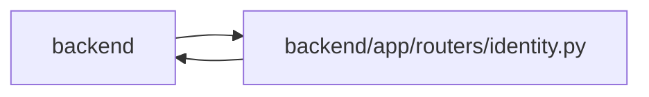

# identity Module

**Path:** `backend/app/routers/identity.py`

## Description

Human sign-in, owner bootstrap, membership and session management.

Exposes sign-in, one-time owner bootstrap, scoped membership administration, explicit profile linking, session management and guest ownership recovery. Account enablement and membership are separate from profile/capacity allocation. The anonymous identity response distinguishes missing configuration, missing membership and expired credentials without exposing private work.

## Imports

| Source | Symbols |
|--------|---------|
| `app.authority` | `Authority`, `AuthorityError`, `internal_authority`, `require_operator` |
| `app.commands` | `commit_or_flush` |
| `app.config` | `get_settings` |
| `app.database` | `get_db` |
| `app.http_authority` | `resolve_http_identity` |
| `app.models.identity` | `Principal`, `WorkspaceMembership`, `WorkspaceAuthorityState`, `ProjectMembership`, `PrincipalProfileLink`, `CommandAudit` |
| `app.models.project` | `Project` |
| `app.models.team_member` | `TeamMemberProfile`, `TeamMemberProfile` |
| `app.models.user_session` | `UserSession` |
| `app.security` | `require_admin_api_key` |
| `app.services.identity_service` | `IdentityService`, `require_identity_writes` |
| `app.services.native_session_service` | `NativeSessionService`, `NativeSessionService`, `NativeSessionService`, `NativeSessionService` |
| `app.services.session_service` | `_cookie_options`, `get_client_ip`, `_get_session_by_token` |
| `app.utils.time` | `utc_now` |
| `datetime` | `datetime`, `timedelta` |
| `fastapi` | `APIRouter`, `Depends`, `Request`, `Response`, `Query` |
| `fastapi.responses` | `RedirectResponse` |
| `pydantic` | `BaseModel`, `ConfigDict`, `Field` |
| `secrets` | `secrets` |
| `sqlalchemy` | `select`, `update` |
| `typing` | `Annotated`, `Literal` |

## Local dependency map

<!-- Auto-generated local dependency summary. Do not edit by hand. -->

> Module-level dependencies exceed the generated-diagram limits, so the diagram and table below group them by top-level package. Counts report the number of module neighbors in each package.

### Internal neighbors

| Direction | Module |
|---|---|
| Inbound | `backend` (1) |
| Outbound | `backend` (14) |

### External packages

| Language | Used packages | Undeclared packages |
|---|---:|---:|
| python | 3 | 0 |

> All 15 module neighbor(s) are summarized by package because the module-level view exceeds the 12-node limit.

## Classes

| Class | Kind | Line | Bases / Target | Description |
|-------|------|------|----------------|-------------|
| [Database](../entities/routers_identity_Database.md) | Type alias | 25 | `Annotated[object, Depends(get_db, scope='function')]` | — |
| [BootstrapOwner](../entities/BootstrapOwner.md) | Pydantic model | 28 | `BaseModel` | — |
| [NativeConnectionStart](../entities/NativeConnectionStart.md) | Pydantic model | 32 | `BaseModel` | — |
| [NativeConnectionExchange](../entities/NativeConnectionExchange.md) | Pydantic model | 37 | `BaseModel` | — |
| [NativeConnectionApproval](../entities/NativeConnectionApproval.md) | Pydantic model | 43 | `BaseModel` | — |
| [NativeConnectionResponse](../entities/NativeConnectionResponse.md) | Pydantic model | 48 | `BaseModel` | — |
| [NativeConnectionDetails](../entities/NativeConnectionDetails.md) | Pydantic model | 55 | `BaseModel` | — |
| [NativeApprovalResponse](../entities/NativeApprovalResponse.md) | Pydantic model | 61 | `BaseModel` | — |
| [NativePendingResponse](../entities/NativePendingResponse.md) | Pydantic model | 65 | `BaseModel` | — |
| [NativeTokenResponse](../entities/NativeTokenResponse.md) | Pydantic model | 69 | `BaseModel` | — |
| [MembershipChange](../entities/MembershipChange.md) | Pydantic model | 104 | `BaseModel` | — |
| [ProfileLinkRequest](../entities/ProfileLinkRequest.md) | Pydantic model | 110 | `BaseModel` | — |
| [GuestTransferRequest](../entities/GuestTransferRequest.md) | Pydantic model | 115 | `BaseModel` | — |
| [PrincipalRecoveryRequest](../entities/PrincipalRecoveryRequest.md) | Pydantic model | 343 | `BaseModel` | — |

## Functions

| Function | Signature | Decorators | Description |
|----------|-----------|------------|-------------|
| `start_native_connection` | *(async)* `(data: NativeConnectionStart, request: Request, response: Response, db: Database)` | `@router.post('/native-connections/start', status_code=201, response_model=NativeConnectionResponse)` | — |
| `exchange_native_connection` | *(async)* `(data: NativeConnectionExchange, request: Request, response: Response, db: Database)` | `@router.post('/native-connections/exchange', response_model=NativePendingResponse \| NativeTokenResponse)` | — |
| `describe_native_connection` | *(async)* `(request_id: str, response: Response, db: Database)` | `@router.get('/native-connections/{request_id}', response_model=NativeConnectionDetails)` | — |
| `approve_native_connection` | *(async)* `(request_id: str, data: NativeConnectionApproval, response: Response, db: Database)` | `@router.post('/native-connections/{request_id}/approve', response_model=NativeApprovalResponse)` | — |
| `me` | *(async)* `(request: Request, response: Response, db: Database)` | `@router.get('/me')` | — |
| `login` | *(async)* `(request: Request, db: Database, return_to: str = '/')` | `@router.get('/login')` | — |
| `callback` | *(async)* `(request: Request, db: Database, code: str, state: str)` | `@router.get('/callback')` | — |
| `bootstrap` | *(async)* `(data: BootstrapOwner, db: Database, _operator: Annotated[None, Depends(require_admin_api_key)])` | `@router.post('/bootstrap')` | — |
| `list_principals` | *(async)* `(db: Database, limit: int = Query(100, ge=1, le=500))` | `@router.get('/principals')` | — |
| `workspace_member` | *(async)* `(principal_id: int, data: MembershipChange, db: Database)` | `@router.put('/workspace-members/{principal_id}')` | — |
| `project_member` | *(async)* `(project_id: int, principal_id: int, data: MembershipChange, db: Database)` | `@router.put('/project-members/{project_id}/{principal_id}')` | — |
| `link_profile` | *(async)* `(principal_id: int, data: ProfileLinkRequest, db: Database)` | `@router.put('/principals/{principal_id}/profile')` | — |
| `transfer_guest` | *(async)* `(data: GuestTransferRequest, request: Request, response: Response, db: Database)` | `@router.post('/transfer-guest')` | — |
| `native_token` | *(async)* `(request: Request, response: Response, db: Database)` | `@router.post('/native-token', response_model=NativeTokenResponse)` | — |
| `sessions` | *(async)* `(db: Database)` | `@router.get('/sessions')` | — |
| `revoke_owned_session` | *(async)* `(public_id: str, db: Database)` | `@router.delete('/sessions/{public_id}')` | — |
| `logout` | *(async)* `(response: Response, db: Database)` | `@router.post('/logout')` | — |
| `cleanup` | *(async)* `(db: Database, limit: int = Query(100, ge=1, le=500))` | `@router.post('/sessions/cleanup')` | — |
| `recover_principal` | *(async)* `(principal_id: int, data: PrincipalRecoveryRequest, db: Database)` | `@router.put('/principals/{principal_id}')` | — |