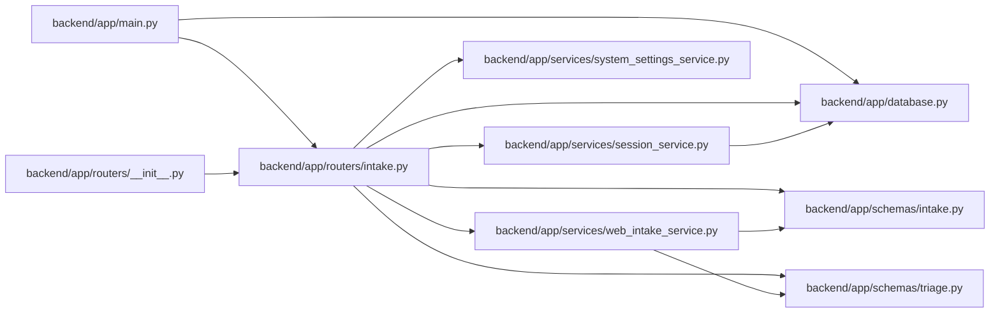

# intake Module

**Path:** `backend/app/routers/intake.py`

## Description

Controlled external intake API router.

## Imports

| Source | Symbols |
|--------|---------|
| `app.database` | `get_db` |
| `app.schemas.intake` | `WebIntakeRequest` |
| `app.schemas.triage` | `TriageItemResponse` |
| `app.services.session_service` | `get_client_ip` |
| `app.services.system_settings_service` | `RuntimeSettingsService` |
| `app.services.web_intake_service` | `WebIntakeConfigurationError`, `WebIntakeRateLimitError`, `WebIntakeService`, `WebIntakeUnauthorizedError` |
| `fastapi` | `APIRouter`, `Body`, `Depends`, `Header`, `HTTPException`, `Request`, `status` |
| `pydantic` | `ValidationError` |
| `sqlalchemy.ext.asyncio` | `AsyncSession` |
| `typing` | `Annotated`, `Any`, `Optional` |

## Local dependency map

<!-- Auto-generated local dependency summary. Do not edit by hand. -->

### Internal neighbors

| Direction | Module |
|---|---|
| Inbound | [app_main](../modules/app_main.md) |
| Inbound | [routers___init__](../modules/routers___init__.md) |
| Outbound | [app_database](../modules/app_database.md) |
| Outbound | [schemas_intake](../modules/schemas_intake.md) |
| Outbound | [schemas_triage](../modules/schemas_triage.md) |
| Outbound | [session_service](../modules/session_service.md) |
| Outbound | [system_settings_service](../modules/system_settings_service.md) |
| Outbound | [web_intake_service](../modules/web_intake_service.md) |

### External packages

| Language | Used packages | Undeclared packages |
|---|---:|---:|
| python | 3 | 0 |

## Functions

| Function | Signature | Decorators | Description |
|----------|-----------|------------|-------------|
| `get_web_intake_service` | *(async)* `(db: Annotated[AsyncSession, Depends(get_db, scope='function')]) -> WebIntakeService` | — | Dependency for controlled web intake. |
| `create_web_intake_item` | *(async)* `(request: Request, raw_data: Annotated[Any, Body(...)], service: Annotated[WebIntakeService, Depends(get_web_intake_service)], authorization: Annotated[Optional[str], Header(alias='Authorization')] = None)` | `@router.post('/intake/web', response_model=TriageItemResponse, status_code=status.HTTP_201_CREATED)` | Create a triage item from a controlled external web/form intake payload. |
