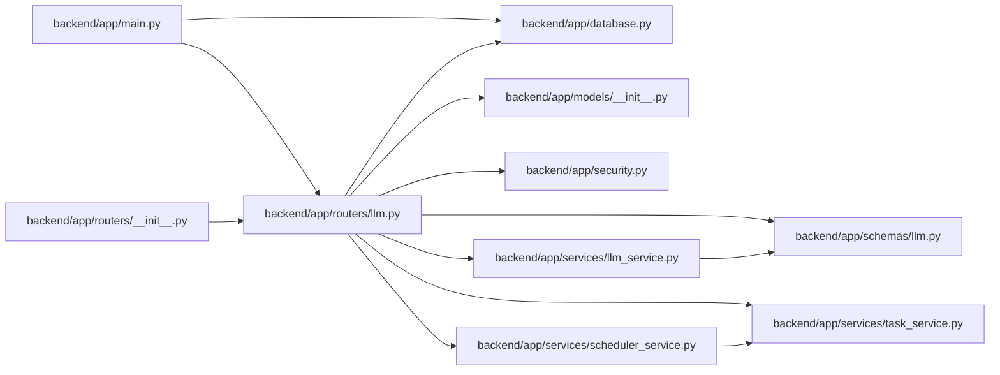

# llm Module

**Path:** `backend/app/routers/llm.py`

## Description

LLM API router.

## Imports

| Source | Symbols |
|--------|---------|
| `app.database` | `get_db` |
| `app.models` | `Project`, `ProjectMilestone`, `Task`, `WorkTemplate` |
| `app.schemas.llm` | `FormalizeDraftRequest`, `FormalizeRequest`, `FormalizeResponse`, `ImproveDescriptionRequest`, `ImproveDescriptionResponse`, `ExplainScheduleRequest`, `ExplainScheduleResponse`, `GroundedAISuggestionResponse`, `TaskAISuggestRequest` |
| `app.security` | `require_admin_api_key` |
| `app.services.llm_service` | `LLMService` |
| `app.services.scheduler_service` | `SchedulerService` |
| `app.services.task_service` | `TaskService` |
| `fastapi` | `APIRouter`, `Body`, `Depends`, `HTTPException`, `status` |
| `sqlalchemy` | `select` |
| `sqlalchemy.ext.asyncio` | `AsyncSession` |
| `typing` | `Annotated` |

## Local dependency map

<!-- Auto-generated local dependency summary. Do not edit by hand. -->

### Internal neighbors

| Direction | Module |
|---|---|
| Inbound | [app_main](../modules/app_main.md) |
| Inbound | [routers___init__](../modules/routers___init__.md) |
| Outbound | [app_database](../modules/app_database.md) |
| Outbound | [models___init__](../modules/models___init__.md) |
| Outbound | [schemas_llm](../modules/schemas_llm.md) |
| Outbound | [security](../modules/security.md) |
| Outbound | [llm_service](../modules/llm_service.md) |
| Outbound | [scheduler_service](../modules/scheduler_service.md) |
| Outbound | [task_service](../modules/task_service.md) |

### External packages

| Language | Used packages | Undeclared packages |
|---|---:|---:|
| python | 2 | 0 |

## Functions

| Function | Signature | Decorators | Description |
|----------|-----------|------------|-------------|
| `get_llm_service` | *(async)* `(db: Annotated[AsyncSession, Depends(get_db, scope='function')]) -> LLMService` | — | Dependency for LLM service. |
| `_task_ai_context_pack` | *(async)* `(db: AsyncSession, data: TaskAISuggestRequest, task: Task \| None = None) -> dict` | — | Build a compact source-labelled context pack for grounded task AI. |
| `formalize_task_draft` | *(async)* `(data: FormalizeDraftRequest, llm_service: Annotated[LLMService, Depends(get_llm_service)])` | `@router.post('/tasks/draft/formalize', response_model=FormalizeResponse)` | Formalize unsaved task form data using LLM/fallback behavior. |
| `improve_task_description_draft` | *(async)* `(data: ImproveDescriptionRequest, llm_service: Annotated[LLMService, Depends(get_llm_service)])` | `@router.post('/tasks/draft/improve-description', response_model=ImproveDescriptionResponse)` | Improve an unsaved task description using LLM/fallback behavior. |
| `suggest_task_draft` | *(async)* `(data: TaskAISuggestRequest, db: Annotated[AsyncSession, Depends(get_db, scope='function')], llm_service: Annotated[LLMService, Depends(get_llm_service)])` | `@router.post('/tasks/ai/suggest', response_model=GroundedAISuggestionResponse)` | Generate grounded advisory suggestions for unsaved task form data. |
| `formalize_task` | *(async)* `(task_id: int, data: FormalizeRequest, db: Annotated[AsyncSession, Depends(get_db, scope='function')], llm_service: Annotated[LLMService, Depends(get_llm_service)])` | `@router.post('/tasks/{task_id}/formalize', response_model=FormalizeResponse)` | Formalize a task using LLM. |
| `improve_task_description` | *(async)* `(task_id: int, data: ImproveDescriptionRequest, db: Annotated[AsyncSession, Depends(get_db, scope='function')], llm_service: Annotated[LLMService, Depends(get_llm_service)])` | `@router.post('/tasks/{task_id}/improve-description', response_model=ImproveDescriptionResponse)` | Improve task description using LLM. |
| `suggest_existing_task` | *(async)* `(task_id: int, data: TaskAISuggestRequest, db: Annotated[AsyncSession, Depends(get_db, scope='function')], llm_service: Annotated[LLMService, Depends(get_llm_service)])` | `@router.post('/tasks/{task_id}/ai/suggest', response_model=GroundedAISuggestionResponse)` | Generate grounded advisory suggestions for an existing task. |
| `explain_schedule` | *(async)* `(iteration_id: int, db: Annotated[AsyncSession, Depends(get_db, scope='function')], llm_service: Annotated[LLMService, Depends(get_llm_service)], data: Annotated[ExplainScheduleRequest \| None, Body()] = None)` | `@router.post('/iterations/{iteration_id}/explain-schedule', response_model=ExplainScheduleResponse)` | Generate human-readable explanation for iteration schedule. |
