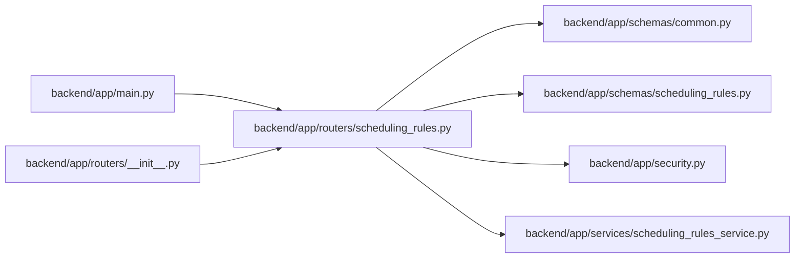

# scheduling_rules Module

**Path:** `backend/app/routers/scheduling_rules.py`

## Description

Scheduling rules API router.

## Imports

| Source | Symbols |
|--------|---------|
| `app.schemas.common` | `MessageResponse` |
| `app.schemas.scheduling_rules` | `SchedulingRulesSchema`, `SchedulingRulesResponse` |
| `app.security` | `require_admin_api_key` |
| `app.services.scheduling_rules_service` | `SchedulingRulesService` |
| `fastapi` | `APIRouter`, `Depends`, `HTTPException`, `status` |
| `logging` | `logging` |

## Local dependency map

<!-- Auto-generated local dependency summary. Do not edit by hand. -->

### Internal neighbors

| Direction | Module |
|---|---|
| Inbound | [app_main](../modules/app_main.md) |
| Inbound | [routers___init__](../modules/routers___init__.md) |
| Outbound | [schemas_common](../modules/schemas_common.md) |
| Outbound | [schemas_scheduling_rules](../modules/schemas_scheduling_rules.md) |
| Outbound | [security](../modules/security.md) |
| Outbound | [scheduling_rules_service](../modules/scheduling_rules_service.md) |

### External packages

| Language | Used packages | Undeclared packages |
|---|---:|---:|
| python | 1 | 0 |

## Functions

| Function | Signature | Decorators | Description |
|----------|-----------|------------|-------------|
| `get_rules_service` | `() -> SchedulingRulesService` | — | Get scheduling rules service singleton. |
| `get_scheduling_rules` | *(async)* `()` | `@router.get('/scheduling-rules', response_model=SchedulingRulesResponse)` | Get current scheduling rules configuration. |
| `update_scheduling_rules` | *(async)* `(rules: SchedulingRulesSchema)` | `@router.put('/scheduling-rules', response_model=SchedulingRulesResponse)` | Update scheduling rules configuration. |
| `reset_scheduling_rules` | *(async)* `()` | `@router.post('/scheduling-rules/reset', response_model=SchedulingRulesResponse)` | Reset scheduling rules to default values. |
