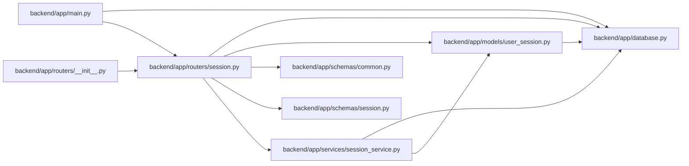

# session Module

**Path:** `backend/app/routers/session.py`

## Description

Browser identity lifecycle API.

## Imports

| Source | Symbols |
|--------|---------|
| `app.database` | `get_db` |
| `app.models.user_session` | `UserSession` |
| `app.schemas.common` | `MessageResponse` |
| `app.schemas.session` | `UserSession` |
| `app.services` | `session_service` |
| `fastapi` | `APIRouter`, `Depends`, `Response` |
| `sqlalchemy.ext.asyncio` | `AsyncSession` |
| `typing` | `Annotated` |

## Local dependency map

<!-- Auto-generated local dependency summary. Do not edit by hand. -->

### Internal neighbors

| Direction | Module |
|---|---|
| Inbound | [app_main](../modules/app_main.md) |
| Inbound | [routers___init__](../modules/routers___init__.md) |
| Outbound | [app_database](../modules/app_database.md) |
| Outbound | [user_session](../modules/user_session.md) |
| Outbound | [schemas_common](../modules/schemas_common.md) |
| Outbound | [schemas_session](../modules/schemas_session.md) |
| Outbound | [session_service](../modules/session_service.md) |

### External packages

| Language | Used packages | Undeclared packages |
|---|---:|---:|
| python | 2 | 0 |

## Functions

| Function | Signature | Decorators | Description |
|----------|-----------|------------|-------------|
| `whoami` | *(async)* `(current_session: Annotated[UserSession, Depends(session_service.get_current_session)]) -> UserSession` | `@router.get('/session/whoami', response_model=UserSessionSchema)` | Return privacy-safe attribution for the current opaque browser session. |
| `rotate_session` | *(async)* `(response: Response, current_session: Annotated[UserSession, Depends(session_service.get_current_session)], db: Annotated[AsyncSession, Depends(get_db, scope='function')]) -> UserSession` | `@router.post('/session/rotate', response_model=UserSessionSchema)` | Rotate the browser token without changing saved-view ownership. |
| `revoke_session` | *(async)* `(response: Response, current_session: Annotated[UserSession, Depends(session_service.get_current_session)], db: Annotated[AsyncSession, Depends(get_db, scope='function')]) -> MessageResponse` | `@router.delete('/session', response_model=MessageResponse)` | Revoke the current browser identity. |
