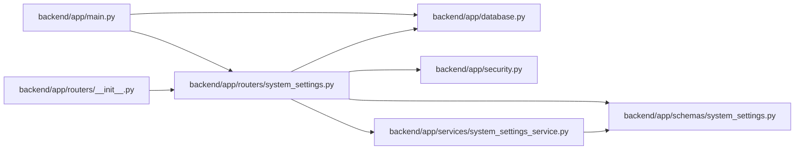

# system_settings Module

**Path:** `backend/app/routers/system_settings.py`

## Description

Runtime system settings API router.

## Imports

| Source | Symbols |
|--------|---------|
| `app.database` | `get_db` |
| `app.schemas.system_settings` | `AppRuntimeSettingsResponse`, `AppRuntimeSettingsUpdate`, `GitHubRuntimeSettingsResponse`, `GitHubRuntimeSettingsUpdate`, `LLMRuntimeSettingsResponse`, `LLMRuntimeSettingsUpdate`, `SystemSettingsResponse`, `WebIntakeRuntimeSettingsResponse`, `WebIntakeRuntimeSettingsUpdate` |
| `app.security` | `require_admin_api_key` |
| `app.services.system_settings_service` | `RuntimeSettingsError`, `RuntimeSettingsService` |
| `fastapi` | `APIRouter`, `Depends`, `HTTPException`, `status` |
| `sqlalchemy.ext.asyncio` | `AsyncSession` |
| `typing` | `Annotated` |

## Local dependency map

<!-- Auto-generated local dependency summary. Do not edit by hand. -->

### Internal neighbors

| Direction | Module |
|---|---|
| Inbound | [app_main](../modules/app_main.md) |
| Inbound | [routers___init__](../modules/routers___init__.md) |
| Outbound | [app_database](../modules/app_database.md) |
| Outbound | [schemas_system_settings](../modules/schemas_system_settings.md) |
| Outbound | [security](../modules/security.md) |
| Outbound | [system_settings_service](../modules/system_settings_service.md) |

### External packages

| Language | Used packages | Undeclared packages |
|---|---:|---:|
| python | 2 | 0 |

## Functions

| Function | Signature | Decorators | Description |
|----------|-----------|------------|-------------|
| `get_runtime_settings_service` | *(async)* `(db: Annotated[AsyncSession, Depends(get_db, scope='function')]) -> RuntimeSettingsService` | — | Dependency for runtime system settings. |
| `_bad_request` | `(error: ValueError) -> HTTPException` | — | — |
| `get_system_settings` | *(async)* `(service: Annotated[RuntimeSettingsService, Depends(get_runtime_settings_service)])` | `@router.get('/system-settings', response_model=SystemSettingsResponse)` | Return resolved runtime settings and restart-required env settings. |
| `update_llm_settings` | *(async)* `(data: LLMRuntimeSettingsUpdate, service: Annotated[RuntimeSettingsService, Depends(get_runtime_settings_service)])` | `@router.put('/system-settings/llm', response_model=LLMRuntimeSettingsResponse)` | Update runtime LLM settings. |
| `update_app_settings` | *(async)* `(data: AppRuntimeSettingsUpdate, service: Annotated[RuntimeSettingsService, Depends(get_runtime_settings_service)])` | `@router.put('/system-settings/app', response_model=AppRuntimeSettingsResponse)` | Update runtime app language settings. |
| `update_github_settings` | *(async)* `(data: GitHubRuntimeSettingsUpdate, service: Annotated[RuntimeSettingsService, Depends(get_runtime_settings_service)])` | `@router.put('/system-settings/github', response_model=GitHubRuntimeSettingsResponse)` | Update runtime GitHub settings. |
| `update_web_intake_settings` | *(async)* `(data: WebIntakeRuntimeSettingsUpdate, service: Annotated[RuntimeSettingsService, Depends(get_runtime_settings_service)])` | `@router.put('/system-settings/web-intake', response_model=WebIntakeRuntimeSettingsResponse)` | Update runtime controlled web-intake settings. |
