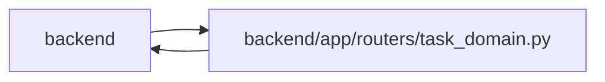

# task_domain Module

**Path:** `backend/app/routers/task_domain.py`

## Description

Compatible domain commands, canonical briefs and bounded task reads.

## Imports

| Source | Symbols |
|--------|---------|
| `app.authority` | `internal_authority`, `require_project`, `require_operator`, `require_project` |
| `app.database` | `get_db` |
| `app.models.identity` | `Principal`, `PrincipalProfileLink`, `ProjectMembership`, `WorkspaceMembership` |
| `app.models.task` | `Task` |
| `app.models.task_brief` | `TaskBriefRevision`, `TaskProgressRecord`, `TaskReviewRecord` |
| `app.models.team_member` | `TeamMemberProfile` |
| `app.schemas.delivery_metrics` | `DeliveryMetricsResponse` |
| `app.schemas.task` | `TaskCreate`, `TaskResponse` |
| `app.schemas.task_brief` | `BriefWrite`, `BriefConvert`, `ProgressWrite`, `TaskReviewWrite`, `TaskReviewResponse`, `CurrentTaskReviewResponse` |
| `app.schemas.task_detail` | `TaskDetailResponse`, `TaskReferencePage`, `HumanWorkResponse` |
| `app.schemas.task_domain` | `BacklogRestoreRequest`, `TaskActionRequest`, `TaskActionsResponse` |
| `app.services.backlog_snapshot_service` | `BacklogSnapshotService`, `BacklogSnapshotService` |
| `app.services.delivery_metrics_service` | `DeliveryMetricsService` |
| `app.services.task_brief_service` | `TaskBriefService` |
| `app.services.task_detail_service` | `TaskDetailService` |
| `app.services.task_domain_service` | `TaskDomainService`, `domain_capabilities` |
| `app.services.task_service` | `TaskService`, `TaskVersionConflictError` |
| `fastapi` | `APIRouter`, `Depends`, `HTTPException`, `Query` |
| `sqlalchemy` | `select`, `or_`, `or_` |
| `sqlalchemy.ext.asyncio` | `AsyncSession` |
| `typing` | `Annotated` |

## Local dependency map

<!-- Auto-generated local dependency summary. Do not edit by hand. -->

> Module-level dependencies exceed the generated-diagram limits, so the diagram and table below group them by top-level package. Counts report the number of module neighbors in each package.

### Internal neighbors

| Direction | Module |
|---|---|
| Inbound | `backend` (4) |
| Outbound | `backend` (17) |

### External packages

| Language | Used packages | Undeclared packages |
|---|---:|---:|
| python | 2 | 0 |

> All 21 module neighbor(s) are summarized by package because the module-level view exceeds the 12-node limit.

## Classes

| Class | Kind | Line | Bases / Target | Description |
|-------|------|------|----------------|-------------|
| [DB](../entities/DB.md) | Type alias | 22 | `Annotated[AsyncSession, Depends(get_db, scope='function')]` | — |

## Functions

| Function | Signature | Decorators | Description |
|----------|-----------|------------|-------------|
| `domain_result` | *(async)* `(awaitable)` | — | — |
| `delivery_metrics` | *(async)* `(db: DB, project_id: int \| None = Query(default=None, ge=1), iteration_id: int \| None = Query(default=None, ge=1), lookback_days: int = Query(default=30, ge=1, le=366))` | `@router.get('/tasks/delivery-metrics', response_model=DeliveryMetricsResponse)` | — |
| `lookup_tasks` | *(async)* `(db: DB, project_id: int \| None = None, iteration_id: int \| None = None, q: str \| None = Query(default=None, max_length=200), backlog_only: bool = False, limit: int = Query(default=50, ge=1, le=100), after_id: int = Query(default=0, ge=0))` | `@router.get('/tasks/lookup', response_model=TaskReferencePage)` | — |
| `task_capabilities` | *(async)* `(db: DB)` | `@router.get('/tasks/capabilities')` | — |
| `human_my_work` | *(async)* `(db: DB, limit: int = Query(default=50, ge=1, le=100), after_id: int = Query(default=0, ge=0), project_id: int \| None = Query(default=None, ge=1), iteration_id: int \| None = Query(default=None, ge=1), backlog_only: bool = False)` | `@router.get('/tasks/my-work', response_model=HumanWorkResponse)` | — |
| `task_owner_options` | *(async)* `(db: DB, project_id: int \| None = None, after_id: int = Query(default=0, ge=0), limit: int = Query(default=100, ge=1, le=100))` | `@router.get('/tasks/owner-options')` | — |
| `task_migration_diagnostics` | *(async)* `(db: DB, after_id: int = Query(default=0, ge=0), limit: int = Query(default=50, ge=1, le=100))` | `@router.get('/tasks/migration-diagnostics')` | — |
| `task_review_queue` | *(async)* `(db: DB, limit: int = Query(default=50, ge=1, le=100), after_id: int = Query(default=0, ge=0), project_id: int \| None = Query(default=None, ge=1), iteration_id: int \| None = Query(default=None, ge=1), backlog_only: bool = False)` | `@router.get('/tasks/review-queue', response_model=TaskReferencePage)` | — |
| `task_detail` | *(async)* `(task_id: int, db: DB, limit: int = Query(default=50, ge=1, le=100), children_after_id: int = Query(default=0, ge=0), dependencies_after_id: int = Query(default=0, ge=0))` | `@router.get('/tasks/{task_id}/detail', response_model=TaskDetailResponse)` | — |
| `create_backlog_task` | *(async)* `(project_id: int, data: TaskCreate, db: DB)` | `@router.post('/projects/{project_id}/backlog', response_model=TaskResponse, status_code=201)` | — |
| `task_actions` | *(async)* `(task_id: int, db: DB)` | `@router.get('/tasks/{task_id}/actions', response_model=TaskActionsResponse)` | — |
| `task_command` | *(async)* `(task_id: int, data: TaskActionRequest, db: DB)` | `@router.post('/tasks/{task_id}/commands', response_model=TaskResponse)` | — |
| `write_task_brief` | *(async)* `(task_id: int, data: BriefWrite, db: DB)` | `@router.put('/tasks/{task_id}/brief', response_model=TaskResponse)` | — |
| `convert_task_brief` | *(async)* `(task_id: int, data: BriefConvert, db: DB)` | `@router.post('/tasks/{task_id}/brief/convert')` | — |
| `record_task_progress` | *(async)* `(task_id: int, data: ProgressWrite, db: DB)` | `@router.post('/tasks/{task_id}/progress', response_model=TaskResponse)` | — |
| `review_task` | *(async)* `(task_id: int, data: TaskReviewWrite, db: DB)` | `@router.post('/tasks/{task_id}/review', response_model=TaskResponse)` | — |
| `task_reviews` | *(async)* `(task_id: int, db: DB, limit: int = Query(default=50, ge=1, le=100), after_id: int = Query(default=0, ge=0))` | `@router.get('/tasks/{task_id}/reviews', response_model=list[TaskReviewResponse])` | — |
| `current_task_review` | *(async)* `(task_id: int, db: DB)` | `@router.get('/tasks/{task_id}/reviews/current', response_model=CurrentTaskReviewResponse)` | — |
| `brief_history_page` | *(async)* `(db, task_id, model, after_id, limit)` | — | — |
| `task_brief_history` | *(async)* `(task_id: int, db: DB, limit: int = Query(default=10, ge=1, le=20), after_id: int = Query(default=0, ge=0))` | `@router.get('/tasks/{task_id}/brief/history')` | — |
| `task_progress_history` | *(async)* `(task_id: int, db: DB, limit: int = Query(default=10, ge=1, le=20), after_id: int = Query(default=0, ge=0))` | `@router.get('/tasks/{task_id}/progress/history')` | — |
| `backlog_snapshots` | *(async)* `(project_id: int, db: DB)` | `@router.get('/projects/{project_id}/backlog/snapshots')` | — |
| `restore_backlog` | *(async)* `(project_id: int, snapshot_id: int, data: BacklogRestoreRequest, db: DB)` | `@router.post('/projects/{project_id}/backlog/snapshots/{snapshot_id}/restore', response_model=list[TaskResponse])` | — |
