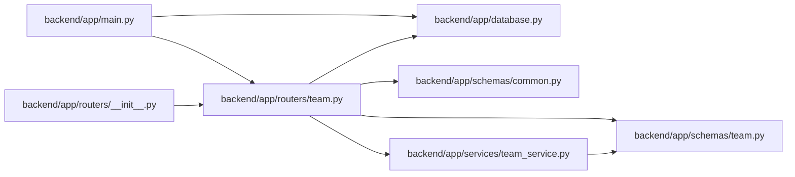

# team Module

**Path:** `backend/app/routers/team.py`

## Description

Team API router.

## Imports

| Source | Symbols |
|--------|---------|
| `app.database` | `get_db` |
| `app.schemas.common` | `MessageResponse` |
| `app.schemas.team` | `TeamMemberCreate`, `TeamMemberUpdate`, `TeamMemberResponse`, `TeamMemberOptionResponse`, `VacationCreate`, `VacationResponse`, `MemberCapacity`, `MemberWorkload`, `VacationImportRequest`, `VacationImportResponse`, `TeamImportRequest`, `TeamImportResponse`, `TeamMemberProfileCreate`, `TeamMemberProfileResponse`, `TeamMemberProfileSkillCreate`, `TeamMemberProfileSkillResponse`, `TeamMemberProfileSkillUpdate`, `TeamMemberProfileUpdate` |
| `app.services.team_service` | `TeamService` |
| `fastapi` | `APIRouter`, `Depends`, `HTTPException`, `status` |
| `sqlalchemy.ext.asyncio` | `AsyncSession` |
| `typing` | `Annotated` |

## Local dependency map

<!-- Auto-generated local dependency summary. Do not edit by hand. -->

### Internal neighbors

| Direction | Module |
|---|---|
| Inbound | [app_main](../modules/app_main.md) |
| Inbound | [routers___init__](../modules/routers___init__.md) |
| Outbound | [app_database](../modules/app_database.md) |
| Outbound | [schemas_common](../modules/schemas_common.md) |
| Outbound | [schemas_team](../modules/schemas_team.md) |
| Outbound | [team_service](../modules/team_service.md) |

### External packages

| Language | Used packages | Undeclared packages |
|---|---:|---:|
| python | 2 | 0 |

## Functions

| Function | Signature | Decorators | Description |
|----------|-----------|------------|-------------|
| `get_team_service` | *(async)* `(db: Annotated[AsyncSession, Depends(get_db, scope='function')]) -> TeamService` | — | Dependency for team service. |
| `get_team_members` | *(async)* `(iteration_id: int, service: Annotated[TeamService, Depends(get_team_service)])` | `@router.get('/iterations/{iteration_id}/team', response_model=list[TeamMemberResponse])` | Get all team members for an iteration. |
| `get_unique_employees` | *(async)* `(service: Annotated[TeamService, Depends(get_team_service)])` | `@router.get('/employees/unique', response_model=list[dict])` | Get unique employees from all iterations for reuse. |
| `list_team_member_options` | *(async)* `(service: Annotated[TeamService, Depends(get_team_service)])` | `@router.get('/team-members', response_model=list[TeamMemberOptionResponse])` | List all team members for owner and assignee selectors. |
| `list_team_member_profiles` | *(async)* `(service: Annotated[TeamService, Depends(get_team_service)])` | `@router.get('/team-member-profiles', response_model=list[TeamMemberProfileResponse])` | List reusable capability profiles. |
| `create_team_member_profile` | *(async)* `(data: TeamMemberProfileCreate, service: Annotated[TeamService, Depends(get_team_service)])` | `@router.post('/team-member-profiles', response_model=TeamMemberProfileResponse, status_code=status.HTTP_201_CREATED)` | Create a reusable capability profile. |
| `get_team_member_profile` | *(async)* `(profile_id: int, service: Annotated[TeamService, Depends(get_team_service)])` | `@router.get('/team-member-profiles/{profile_id}', response_model=TeamMemberProfileResponse)` | Get a reusable capability profile. |
| `update_team_member_profile` | *(async)* `(profile_id: int, data: TeamMemberProfileUpdate, service: Annotated[TeamService, Depends(get_team_service)])` | `@router.put('/team-member-profiles/{profile_id}', response_model=TeamMemberProfileResponse)` | Update a reusable capability profile. |
| `delete_team_member_profile` | *(async)* `(profile_id: int, service: Annotated[TeamService, Depends(get_team_service)])` | `@router.delete('/team-member-profiles/{profile_id}', response_model=MessageResponse)` | Delete a reusable capability profile and detach linked team members. |
| `create_team_member_profile_skill` | *(async)* `(profile_id: int, data: TeamMemberProfileSkillCreate, service: Annotated[TeamService, Depends(get_team_service)])` | `@router.post('/team-member-profiles/{profile_id}/skills', response_model=TeamMemberProfileSkillResponse, status_code=status.HTTP_201_CREATED)` | Add a skill or weakness to a reusable capability profile. |
| `update_team_member_profile_skill` | *(async)* `(profile_id: int, skill_id: int, data: TeamMemberProfileSkillUpdate, service: Annotated[TeamService, Depends(get_team_service)])` | `@router.put('/team-member-profiles/{profile_id}/skills/{skill_id}', response_model=TeamMemberProfileSkillResponse)` | Update a skill or weakness on a reusable capability profile. |
| `delete_team_member_profile_skill` | *(async)* `(profile_id: int, skill_id: int, service: Annotated[TeamService, Depends(get_team_service)])` | `@router.delete('/team-member-profiles/{profile_id}/skills/{skill_id}', response_model=MessageResponse)` | Delete a skill or weakness from a reusable capability profile. |
| `create_team_member` | *(async)* `(iteration_id: int, data: TeamMemberCreate, service: Annotated[TeamService, Depends(get_team_service)])` | `@router.post('/iterations/{iteration_id}/team', response_model=TeamMemberResponse, status_code=status.HTTP_201_CREATED)` | Add a team member to an iteration. |
| `get_team_member` | *(async)* `(member_id: int, service: Annotated[TeamService, Depends(get_team_service)])` | `@router.get('/team-members/{member_id}', response_model=TeamMemberResponse)` | Get team member by ID. |
| `update_team_member` | *(async)* `(member_id: int, data: TeamMemberUpdate, service: Annotated[TeamService, Depends(get_team_service)])` | `@router.put('/team-members/{member_id}', response_model=TeamMemberResponse)` | Update a team member. |
| `delete_team_member` | *(async)* `(member_id: int, service: Annotated[TeamService, Depends(get_team_service)])` | `@router.delete('/team-members/{member_id}', response_model=MessageResponse)` | Delete a team member. |
| `get_member_capacity` | *(async)* `(member_id: int, service: Annotated[TeamService, Depends(get_team_service)])` | `@router.get('/team-members/{member_id}/capacity', response_model=MemberCapacity)` | Calculate capacity for a team member. |
| `get_member_workload` | *(async)* `(member_id: int, service: Annotated[TeamService, Depends(get_team_service)])` | `@router.get('/team-members/{member_id}/workload', response_model=MemberWorkload)` | Get workload information for a team member. |
| `get_vacations` | *(async)* `(member_id: int, service: Annotated[TeamService, Depends(get_team_service)])` | `@router.get('/team-members/{member_id}/vacations', response_model=list[VacationResponse])` | Get vacations for a team member. |
| `add_vacation` | *(async)* `(member_id: int, data: VacationCreate, service: Annotated[TeamService, Depends(get_team_service)])` | `@router.post('/team-members/{member_id}/vacations', response_model=VacationResponse, status_code=status.HTTP_201_CREATED)` | Add vacation for a team member. |
| `delete_vacation` | *(async)* `(vacation_id: int, service: Annotated[TeamService, Depends(get_team_service)])` | `@router.delete('/vacations/{vacation_id}', response_model=MessageResponse)` | Delete a vacation. |
| `import_team_vacations` | *(async)* `(iteration_id: int, data: VacationImportRequest, service: Annotated[TeamService, Depends(get_team_service)])` | `@router.post('/iterations/{iteration_id}/team/vacations/import', response_model=VacationImportResponse)` | Import vacation periods for iteration team members from CSV text. |
| `import_team_members` | *(async)* `(iteration_id: int, data: TeamImportRequest, service: Annotated[TeamService, Depends(get_team_service)])` | `@router.post('/iterations/{iteration_id}/team/import', response_model=TeamImportResponse, status_code=status.HTTP_201_CREATED)` | Import team members from text format. |
