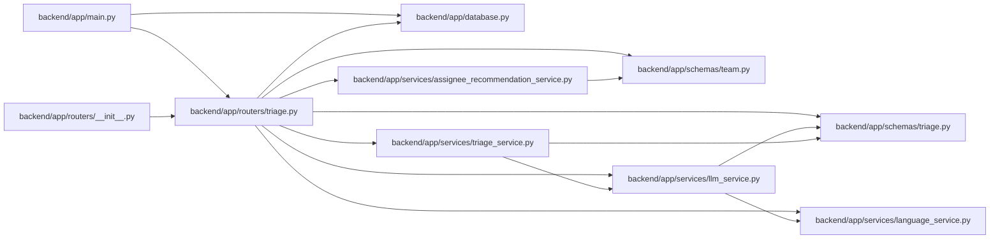

# triage Module

**Path:** `backend/app/routers/triage.py`

## Description

Triage API router.

## Imports

| Source | Symbols |
|--------|---------|
| `app.database` | `get_db` |
| `app.schemas.team` | `AssigneeRecommendationResponse` |
| `app.schemas.triage` | `TriageActionRequest`, `TriageClassificationSuggestionResponse`, `TriageConvertToTaskRequest`, `TriageConvertToTaskResponse`, `TriageDuplicateRequest`, `TriageDuplicateSuggestionsResponse`, `TriageItemCreate`, `TriageItemResponse`, `TriageItemStatus`, `TriageItemUpdate`, `TriageSnoozeRequest`, `TriageTaskDraftRequest`, `TriageTaskDraftResponse` |
| `app.services.assignee_recommendation_service` | `AssigneeRecommendationService` |
| `app.services.language_service` | `backend_error_message`, `entity_not_found_message`, `resolve_runtime_ui_language` |
| `app.services.llm_service` | `LLMService` |
| `app.services.triage_service` | `TriageConflictError`, `TriageDraftNotFoundError`, `TriageService` |
| `fastapi` | `APIRouter`, `Depends`, `HTTPException`, `Query`, `status` |
| `sqlalchemy.ext.asyncio` | `AsyncSession` |
| `typing` | `Annotated`, `Optional` |

## Local dependency map

<!-- Auto-generated local dependency summary. Do not edit by hand. -->

### Internal neighbors

| Direction | Module |
|---|---|
| Inbound | [app_main](../modules/app_main.md) |
| Inbound | [routers___init__](../modules/routers___init__.md) |
| Outbound | [app_database](../modules/app_database.md) |
| Outbound | [schemas_team](../modules/schemas_team.md) |
| Outbound | [schemas_triage](../modules/schemas_triage.md) |
| Outbound | [assignee_recommendation_service](../modules/assignee_recommendation_service.md) |
| Outbound | [language_service](../modules/language_service.md) |
| Outbound | [llm_service](../modules/llm_service.md) |
| Outbound | [triage_service](../modules/triage_service.md) |

### External packages

| Language | Used packages | Undeclared packages |
|---|---:|---:|
| python | 2 | 0 |

## Functions

| Function | Signature | Decorators | Description |
|----------|-----------|------------|-------------|
| `get_triage_service` | *(async)* `(db: Annotated[AsyncSession, Depends(get_db, scope='function')]) -> TriageService` | — | Dependency for triage service. |
| `get_llm_service` | *(async)* `(db: Annotated[AsyncSession, Depends(get_db, scope='function')]) -> LLMService` | — | Dependency for LLM-powered triage classification. |
| `get_assignee_recommendation_service` | *(async)* `(db: Annotated[AsyncSession, Depends(get_db, scope='function')]) -> AssigneeRecommendationService` | — | Dependency for assignee recommendation service. |
| `_bad_request` | *(async)* `(service, error: ValueError) -> HTTPException` | — | — |
| `_not_found_detail` | *(async)* `(service, triage_item_id: int) -> str` | — | — |
| `list_triage_items` | *(async)* `(service: Annotated[TriageService, Depends(get_triage_service)], active: Annotated[Optional[bool], Query()] = True, statuses: Annotated[Optional[list[TriageItemStatus]], Query(alias='status')] = None, q: Optional[str] = Query(None, min_length=1), source: Optional[str] = Query(None, min_length=1, max_length=100), limit: int = Query(100, ge=1, le=500), offset: int = Query(0, ge=0))` | `@router.get('/triage', response_model=list[TriageItemResponse])` | List triage items. |
| `create_triage_item` | *(async)* `(data: TriageItemCreate, service: Annotated[TriageService, Depends(get_triage_service)])` | `@router.post('/triage', response_model=TriageItemResponse, status_code=status.HTTP_201_CREATED)` | Create a triage item. |
| `get_triage_item` | *(async)* `(triage_item_id: int, service: Annotated[TriageService, Depends(get_triage_service)])` | `@router.get('/triage/{triage_item_id}', response_model=TriageItemResponse)` | Get a triage item by ID. |
| `get_triage_duplicate_suggestions` | *(async)* `(triage_item_id: int, service: Annotated[TriageService, Depends(get_triage_service)], limit_per_type: int = Query(5, ge=1, le=20), min_score: float = Query(0.1, ge=0))` | `@router.get('/triage/{triage_item_id}/duplicate-suggestions', response_model=TriageDuplicateSuggestionsResponse)` | Get advisory duplicate suggestions for a triage item. |
| `classify_triage_item` | *(async)* `(triage_item_id: int, service: Annotated[TriageService, Depends(get_triage_service)], llm_service: Annotated[LLMService, Depends(get_llm_service)])` | `@router.post('/triage/{triage_item_id}/classify', response_model=TriageClassificationSuggestionResponse, status_code=status.HTTP_201_CREATED)` | Create an advisory classification suggestion for a triage item. |
| `get_triage_assignee_recommendations` | *(async)* `(triage_item_id: int, service: Annotated[AssigneeRecommendationService, Depends(get_assignee_recommendation_service)], iteration_id: Optional[int] = Query(None))` | `@router.get('/triage/{triage_item_id}/assignee-recommendations', response_model=list[AssigneeRecommendationResponse])` | Return explainable assignee recommendations for a triage item. |
| `list_triage_classification_suggestions` | *(async)* `(triage_item_id: int, service: Annotated[TriageService, Depends(get_triage_service)], limit: int = Query(20, ge=1, le=100))` | `@router.get('/triage/{triage_item_id}/classification-suggestions', response_model=list[TriageClassificationSuggestionResponse])` | List stored advisory classification suggestions for a triage item. |
| `draft_triage_task` | *(async)* `(triage_item_id: int, data: TriageTaskDraftRequest, service: Annotated[TriageService, Depends(get_triage_service)], llm_service: Annotated[LLMService, Depends(get_llm_service)])` | `@router.post('/triage/{triage_item_id}/draft-task', response_model=TriageTaskDraftResponse)` | Generate transient task draft details for triage conversion. |
| `update_triage_item` | *(async)* `(triage_item_id: int, data: TriageItemUpdate, service: Annotated[TriageService, Depends(get_triage_service)])` | `@router.put('/triage/{triage_item_id}', response_model=TriageItemResponse)` | Update editable triage item metadata. |
| `accept_triage_item` | *(async)* `(triage_item_id: int, data: TriageActionRequest, service: Annotated[TriageService, Depends(get_triage_service)])` | `@router.post('/triage/{triage_item_id}/accept', response_model=TriageItemResponse)` | Accept a triage item. |
| `decline_triage_item` | *(async)* `(triage_item_id: int, data: TriageActionRequest, service: Annotated[TriageService, Depends(get_triage_service)])` | `@router.post('/triage/{triage_item_id}/decline', response_model=TriageItemResponse)` | Decline a triage item. |
| `snooze_triage_item` | *(async)* `(triage_item_id: int, data: TriageSnoozeRequest, service: Annotated[TriageService, Depends(get_triage_service)])` | `@router.post('/triage/{triage_item_id}/snooze', response_model=TriageItemResponse)` | Snooze a triage item. |
| `mark_triage_item_duplicate` | *(async)* `(triage_item_id: int, data: TriageDuplicateRequest, service: Annotated[TriageService, Depends(get_triage_service)])` | `@router.post('/triage/{triage_item_id}/mark-duplicate', response_model=TriageItemResponse)` | Mark a triage item as duplicate. |
| `convert_triage_item_to_task` | *(async)* `(triage_item_id: int, data: TriageConvertToTaskRequest, service: Annotated[TriageService, Depends(get_triage_service)])` | `@router.post('/triage/{triage_item_id}/convert-to-task', response_model=TriageConvertToTaskResponse)` | Convert a triage item to a planned task. |
