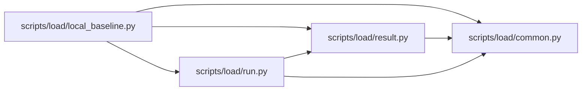

# run Module

**Path:** `scripts/load/run.py`

## Description

Run deterministic, production-shaped REST and MCP load through public APIs.

## Imports

| Source | Symbols |
|--------|---------|
| `__future__` | `annotations` |
| `argparse` | `argparse` |
| `asyncio` | `asyncio` |
| `collections` | `Counter`, `defaultdict` |
| `contextlib` | `AsyncExitStack` |
| `dataclasses` | `dataclass`, `field` |
| `datetime` | `UTC`, `datetime` |
| `hashlib` | `hashlib` |
| `httpx` | `httpx` |
| `importlib.metadata` | `importlib.metadata` |
| `json` | `json` |
| `math` | `math` |
| `mcp` | `ClientSession` |
| `mcp.client.streamable_http` | `streamable_http_client` |
| `os` | `os` |
| `pathlib` | `Path` |
| `random` | `random` |
| `scripts.load.common` | `HTTP_TOOL`, `MCP_TOOL`, `QualificationInputError`, `authorized_base_url`, `capacity_contract`, `contract_sha256`, `read_json_object`, `sha256_file`, `traffic_profile`, `utc_now_text` |
| `scripts.load.result` | `evaluate_client_gates`, `evaluate_external_gates`, `evaluate_workload_gates`, `latency_summary`, `measurement`, `result_status`, `write_result` |
| `sys` | `sys` |
| `time` | `monotonic` |
| `typing` | `Any`, `Mapping` |
| `urllib.parse` | `urlsplit` |
| `uuid` | `uuid4` |

## Local dependency map

<!-- Auto-generated local dependency summary. Do not edit by hand. -->

### Internal neighbors

| Direction | Module |
|---|---|
| Inbound | [local_baseline](../modules/local_baseline.md) |
| Outbound | [load_common](../modules/load_common.md) |
| Outbound | [result](../modules/result.md) |

### External packages

| Language | Used packages | Undeclared packages |
|---|---:|---:|
| python | 2 | 2 |

## Classes

| Class | Line | Bases | Description |
|-------|------|-------|-------------|
| [Attempt](../entities/Attempt.md) | 69 | — | — |
| [Recorder](../entities/Recorder.md) | 84 | — | — |
| [OperationBuilder](../entities/OperationBuilder.md) | 225 | — | Build bounded, deterministic request payloads without response lookups. |
| [VirtualClient](../entities/VirtualClient.md) | 568 | — | — |

## Functions

| Function | Signature | Decorators | Description |
|----------|-----------|------------|-------------|
| `_validated_retry_policy` | `(profile: Mapping[str, Any]) -> dict[str, Any] \| None` | — | — |
| `_retry_delay_seconds` | `(policy: Mapping[str, Any], *, seed: int, logical_index: int, retry_index: int) -> float` | — | — |
| `_response_cardinality` | `(profile: str, value: Any, *, status: int) -> int` | — | — |
| `_phase_shape` | `(profile: Mapping[str, Any], phase: str, *, duration_override: float \| None, rps_override: float \| None) -> tuple[float, float]` | — | — |
| `_weighted_plan` | `(operations: list[Mapping[str, Any]], attempts: int, seed: int) -> list[Mapping[str, Any]]` | — | — |
| `_distribution_plan` | `(distribution: Mapping[str, Any], attempts: int, seed: int) -> list[str]` | — | — |
| `_request_class` | `(operation: Mapping[str, Any]) -> str` | — | — |
| `_result_payload` | `(*, args: argparse.Namespace, contract: Mapping[str, Any], seed_manifest: Mapping[str, Any] \| None, release: Mapping[str, Any], duration: float, target_rps: float, target_clients: int, actual_duration: float, recorder: Recorder, snapshots: Mapping[str, Any], external_metrics: Mapping[str, Any], integrity: Mapping[str, Any], operation_plan: list[Mapping[str, Any]]) -> dict[str, Any]` | — | — |
| `_decode_tool_result` | `(result: Any) -> tuple[int, dict[str, Any] \| None, int]` | — | — |
| `_update_agent_state` | `(client: VirtualClient, operation_id: str, status: int, structured: Mapping[str, Any] \| None) -> bool` | — | — |
| `_perform_attempt` | *(async)* `(operation: Mapping[str, Any], *, builder: OperationBuilder, browser_clients: list[VirtualClient], agent_clients: list[VirtualClient], recorder: Recorder, client_counter: Counter[str], logical_index: int, retry_policy: Mapping[str, Any] \| None) -> None` | — | — |
| `_snapshot` | *(async)* `(client: httpx.AsyncClient) -> tuple[dict[str, Any] \| None, str \| None]` | — | — |
| `_select_browser_credentials` | `(credentials: list[Mapping[str, Any]], count: int) -> list[Mapping[str, Any]]` | — | — |
| `_run_live` | *(async)* `(*, args: argparse.Namespace, profile: Mapping[str, Any], credentials: Mapping[str, Any], duration: float, target_rps: float, target_clients: int, seed: int) -> tuple[Recorder, dict[str, Any], float, list[Mapping[str, Any]]]` | — | — |
| `_load_optional` | `(path: Path \| None, *, sealed: bool = True) -> dict[str, Any]` | — | — |
| `_load_external_metrics` | `(path: Path \| None) -> dict[str, Any]` | — | — |
| `_parser` | `() -> argparse.ArgumentParser` | — | — |
| `main` | `() -> int` | — | — |
