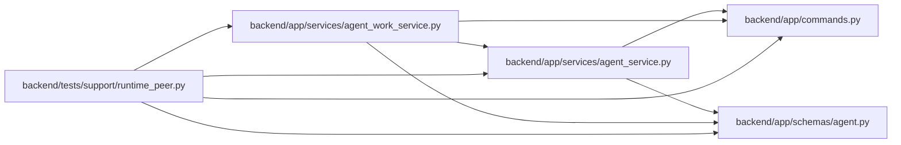

# runtime_peer Module

**Path:** `backend/tests/support/runtime_peer.py`

## Description

This test-only peer reads a disposable database request from standard input and opens a fresh process, engine and command transaction for every operation. Worker, PM and verifier use separate scoped credentials. It exercises protocol state and idempotent receipts, with no provider runtime or pilot qualification claim.

Disposable protocol peer: each invocation uses a new process and connection.

## Imports

| Source | Symbols |
|--------|---------|
| `app.commands` | `command_transaction` |
| `app.schemas.agent` | `AgentRecoveryRequeue`, `AgentReviewVerdict`, `AgentTaskAssignmentCreate`, `AgentTaskAssignmentUpdate`, `AgentWorkBegin`, `AgentWorkRenew`, `AgentWorkSubmit`, `AgentWorkTerminal` |
| `app.services.agent_service` | `AgentService` |
| `app.services.agent_work_service` | `AgentWorkService` |
| `asyncio` | `asyncio` |
| `json` | `json` |
| `os` | `os` |
| `sqlalchemy` | `event` |
| `sqlalchemy.ext.asyncio` | `async_sessionmaker`, `create_async_engine` |
| `sys` | `sys` |

## Local dependency map

<!-- Auto-generated local dependency summary. Do not edit by hand. -->

### Internal neighbors

| Direction | Module |
|---|---|
| Outbound | [commands](../modules/commands.md) |
| Outbound | [schemas_agent](../modules/schemas_agent.md) |
| Outbound | [agent_service](../modules/agent_service.md) |
| Outbound | [agent_work_service](../modules/agent_work_service.md) |

### External packages

| Language | Used packages | Undeclared packages |
|---|---:|---:|
| python | 1 | 0 |

## Functions

| Function | Signature | Decorators | Description |
|----------|-----------|------------|-------------|
| `execute` | *(async)* `(packet)` | — | — |
