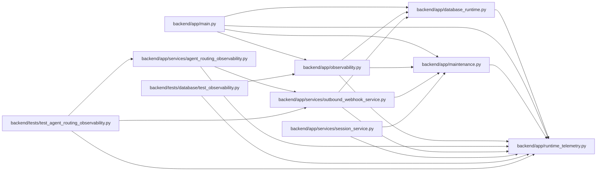

# runtime_telemetry Module

**Path:** `backend/app/runtime_telemetry.py`

## Description

Small dependency-free runtime telemetry used by probes and qualification.

The registry intentionally keeps only aggregate counters, gauges, and bounded
histogram summaries.  It never records SQL text, parameters, credentials, or
request bodies.

## Imports

| Source | Symbols |
|--------|---------|
| `__future__` | `annotations` |
| `collections` | `defaultdict` |
| `contextvars` | `ContextVar` |
| `dataclasses` | `dataclass` |
| `math` | `math` |
| `threading` | `Lock` |
| `time` | `monotonic` |
| `typing` | `Mapping` |

## Local dependency map

<!-- Auto-generated local dependency summary. Do not edit by hand. -->

### Internal neighbors

| Direction | Module |
|---|---|
| Inbound | [database_runtime](../modules/database_runtime.md) |
| Inbound | [app_main](../modules/app_main.md) |
| Inbound | [maintenance](../modules/maintenance.md) |
| Inbound | [observability](../modules/observability.md) |
| Inbound | [agent_routing_observability](../modules/agent_routing_observability.md) |
| Inbound | [outbound_webhook_service](../modules/outbound_webhook_service.md) |
| Inbound | [session_service](../modules/session_service.md) |
| Inbound | [test_observability](../modules/test_observability.md) |
| Inbound | [test_agent_routing_observability](../modules/test_agent_routing_observability.md) |

## Classes

| Class | Line | Bases | Description |
|-------|------|-------|-------------|
| [MetricRegistry](../entities/MetricRegistry.md) | 36 | — | Process-local Prometheus-compatible aggregate registry. |
| [ActivitySnapshot](../entities/ActivitySnapshot.md) | 137 | — | — |
| [RuntimeActivity](../entities/RuntimeActivity.md) | 147 | — | Track drain-relevant process activity without database-backed flags. |

## Functions

| Function | Signature | Decorators | Description |
|----------|-----------|------------|-------------|
| `_metric_key` | `(name: str, labels: Mapping[str, str] \| None = None) -> MetricKey` | — | — |
| `_render_labels` | `(labels: tuple[tuple[str, str], ...]) -> str` | — | — |
