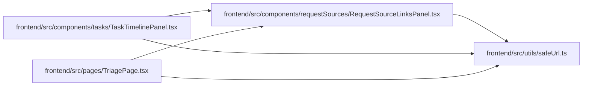

# safeUrl Module

**Path:** `frontend/src/utils/safeUrl.ts`

## Description

_Auto-generated from `frontend/src/utils/safeUrl.ts`._

## Module Signals

| Signal | Values |
|--------|--------|
| Exports | `safeExternalHref` |

## Local dependency map

<!-- Auto-generated local dependency summary. Do not edit by hand. -->

### Internal neighbors

| Direction | Module |
|---|---|
| Inbound | [RequestSourceLinksPanel](../modules/RequestSourceLinksPanel.md) |
| Inbound | [TaskTimelinePanel](../modules/TaskTimelinePanel.md) |
| Inbound | [TriagePage](../modules/TriagePage.md) |

## Functions

| Function | Signature | Decorators | Description |
|----------|-----------|------------|-------------|
| `safeExternalHref` | `(value: string \| null) -> string \| undefined` | — | — |
