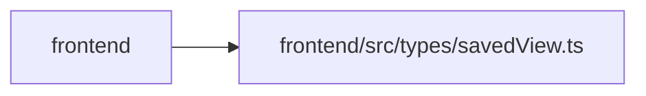

# savedView Module

**Path:** `frontend/src/types/savedView.ts`

## Description

_Auto-generated from `frontend/src/types/savedView.ts`._

## Module Signals

| Signal | Values |
|--------|--------|
| Exports | `SavedView`, `SavedViewCreate`, `SavedViewDashboardCard`, `SavedViewDuplicate`, `SavedViewListParams`, `SavedViewScope`, `SavedViewType`, `SavedViewUpdate` |

## Local dependency map

<!-- Auto-generated local dependency summary. Do not edit by hand. -->

> Module-level dependencies exceed the generated-diagram limits, so the diagram and table below group them by top-level package. Counts report the number of module neighbors in each package.

### Internal neighbors

| Direction | Module |
|---|---|
| Inbound | `frontend` (12) |

> All 12 module neighbor(s) are summarized by package because the module-level view exceeds the 12-node limit.

## Classes

| Class | Kind | Line | Bases / Target | Description |
|-------|------|------|----------------|-------------|
| [SavedView](../entities/savedView_SavedView.md) | Class | 4 | — | — |
| [SavedViewDashboardCard](../entities/SavedViewDashboardCard.md) | Class | 24 | — | — |
| [SavedViewListParams](../entities/SavedViewListParams.md) | Class | 37 | — | — |
| [SavedViewCreate](../entities/savedView_SavedViewCreate.md) | Class | 41 | — | — |
| [SavedViewUpdate](../entities/savedView_SavedViewUpdate.md) | Class | 52 | — | — |
| [SavedViewDuplicate](../entities/SavedViewDuplicate.md) | Class | 63 | — | — |
| [SavedViewType](../entities/savedView_SavedViewType.md) | Type alias | 1 | — | — |
| [SavedViewScope](../entities/savedView_SavedViewScope.md) | Type alias | 2 | — | — |
