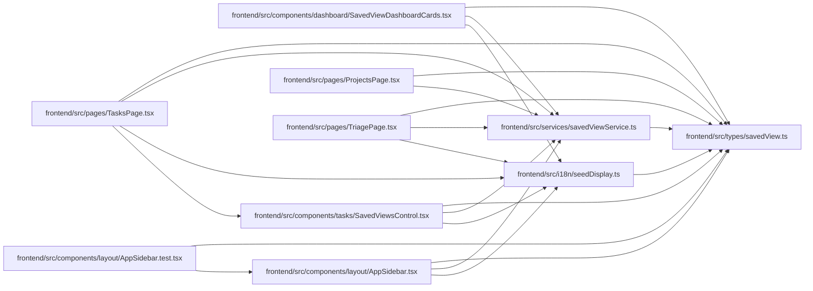

# savedView Module

**Path:** `frontend/src/types/savedView.ts`

## Description

_Auto-generated from `frontend/src/types/savedView.ts`._

## Module Signals

| Signal | Values |
|--------|--------|
| Exports | `SavedView`, `SavedViewCreate`, `SavedViewDashboardCard`, `SavedViewDuplicate`, `SavedViewListParams`, `SavedViewScope`, `SavedViewType`, `SavedViewUpdate` |

## Local dependency map

<!-- Auto-generated local dependency summary. Do not edit by hand. -->

### Internal neighbors

| Direction | Module |
|---|---|
| Inbound | [SavedViewDashboardCards](../modules/SavedViewDashboardCards.md) |
| Inbound | [AppSidebar.test](../modules/AppSidebar.test.md) |
| Inbound | [AppSidebar](../modules/AppSidebar.md) |
| Inbound | [SavedViewsControl](../modules/SavedViewsControl.md) |
| Inbound | [seedDisplay](../modules/seedDisplay.md) |
| Inbound | [ProjectsPage](../modules/ProjectsPage.md) |
| Inbound | [TasksPage](../modules/TasksPage.md) |
| Inbound | [TriagePage](../modules/TriagePage.md) |
| Inbound | [savedViewService](../modules/savedViewService.md) |

## Classes

| Class | Kind | Line | Bases / Target | Description |
|-------|------|------|----------------|-------------|
| [SavedView](../entities/savedView_SavedView.md) | Class | 4 | — | — |
| [SavedViewDashboardCard](../entities/SavedViewDashboardCard.md) | Class | 24 | — | — |
| [SavedViewListParams](../entities/SavedViewListParams.md) | Class | 37 | — | — |
| [SavedViewCreate](../entities/savedView_SavedViewCreate.md) | Class | 41 | — | — |
| [SavedViewUpdate](../entities/savedView_SavedViewUpdate.md) | Class | 52 | — | — |
| [SavedViewDuplicate](../entities/SavedViewDuplicate.md) | Class | 63 | — | — |
| [SavedViewType](../entities/savedView_SavedViewType.md) | Type alias | 1 | — | — |
| [SavedViewScope](../entities/savedView_SavedViewScope.md) | Type alias | 2 | — | — |
