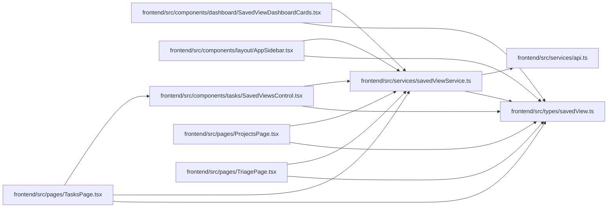

# savedViewService Module

**Path:** `frontend/src/services/savedViewService.ts`

## Description

_Auto-generated from `frontend/src/services/savedViewService.ts`._

## Imports

| Source | Symbols |
|--------|---------|
| `../types/savedView` | `SavedView`, `SavedViewCreate`, `SavedViewDashboardCard`, `SavedViewDuplicate`, `SavedViewListParams`, `SavedViewUpdate` |
| `./api` | `api` |

## Module Signals

| Signal | Values |
|--------|--------|
| Exports | `FrontendSavedViewService`, `savedViewService` |
| Constants | `savedViewService` |

## Local dependency map

<!-- Auto-generated local dependency summary. Do not edit by hand. -->

### Internal neighbors

| Direction | Module |
|---|---|
| Inbound | [SavedViewDashboardCards](../modules/SavedViewDashboardCards.md) |
| Inbound | [AppSidebar](../modules/AppSidebar.md) |
| Inbound | [SavedViewsControl](../modules/SavedViewsControl.md) |
| Inbound | [ProjectsPage](../modules/ProjectsPage.md) |
| Inbound | [TasksPage](../modules/TasksPage.md) |
| Inbound | [TriagePage](../modules/TriagePage.md) |
| Outbound | [api](../modules/api.md) |
| Outbound | [savedView](../modules/savedView.md) |

## Classes

| Class | Kind | Line | Bases / Target | Description |
|-------|------|------|----------------|-------------|
| [FrontendSavedViewService](../entities/FrontendSavedViewService.md) | Class | 17 | — | — |
