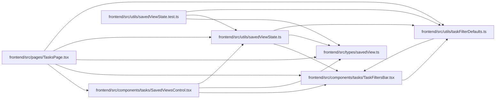

# savedViewState Module

**Path:** `frontend/src/utils/savedViewState.ts`

## Description

Compares effective saved-view filters and ordering against current defaults, treating label selections as sets. This supports explicit modified-state disclosure instead of implying that local filters are saved or shared.

## Imports

| Source | Symbols |
|--------|---------|
| `../components/tasks/TaskFiltersBar` | `TaskFilters` |
| `../types/savedView` | `SavedView` |
| `./taskFilterDefaults` | `defaultFilters` |

## Module Signals

| Signal | Values |
|--------|--------|
| Exports | `filterSignature`, `savedViewModified` |

## Local dependency map

<!-- Auto-generated local dependency summary. Do not edit by hand. -->

### Internal neighbors

| Direction | Module |
|---|---|
| Inbound | [SavedViewsControl](../modules/SavedViewsControl.md) |
| Inbound | [TasksPage](../modules/TasksPage.md) |
| Inbound | [savedViewState.test](../modules/savedViewState.test.md) |
| Outbound | [TaskFiltersBar](../modules/TaskFiltersBar.md) |
| Outbound | [savedView](../modules/savedView.md) |
| Outbound | [taskFilterDefaults](../modules/taskFilterDefaults.md) |

## Functions

| Function | Signature | Decorators | Description |
|----------|-----------|------------|-------------|
| `filterSignature` | `(raw: Record<string, unknown> \| TaskFilters)` | — | — |
| `savedViewModified` | `(view: SavedView \| null \| undefined, filters: TaskFilters, sortKey: string)` | — | — |
