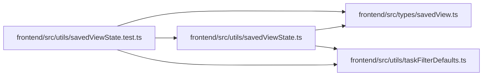

# savedViewState.test Module

**Path:** `frontend/src/utils/savedViewState.test.ts`

## Description

_Auto-generated from `frontend/src/utils/savedViewState.test.ts`._

## Imports

| Source | Symbols |
|--------|---------|
| `../types/savedView` | `SavedView` |
| `./savedViewState` | `filterSignature`, `savedViewModified` |
| `./taskFilterDefaults` | `defaultFilters` |
| `vitest` | `describe`, `expect`, `it` |

## Module Signals

| Signal | Values |
|--------|--------|
| Module calls | `describe` |

## Local dependency map

<!-- Auto-generated local dependency summary. Do not edit by hand. -->

### Internal neighbors

| Direction | Module |
|---|---|
| Outbound | [savedView](../modules/savedView.md) |
| Outbound | [savedViewState](../modules/savedViewState.md) |
| Outbound | [taskFilterDefaults](../modules/taskFilterDefaults.md) |

### External packages

| Language | Used packages | Undeclared packages |
|---|---:|---:|
| typescript | 1 | 0 |
