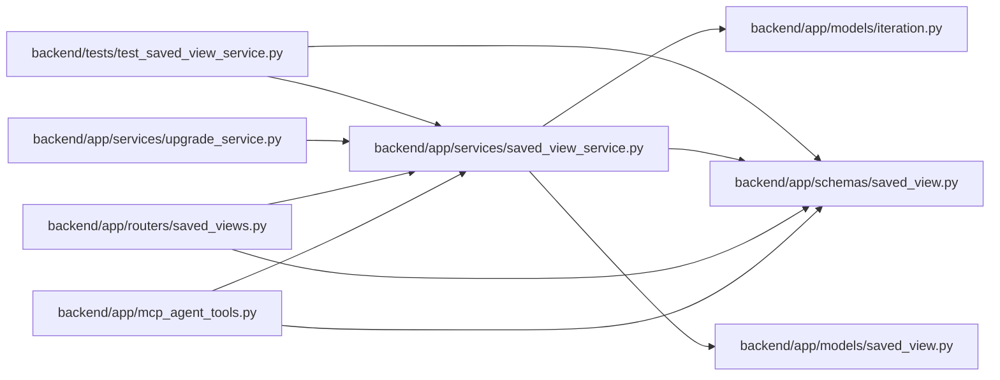

# saved_view_service Module

**Path:** `backend/app/services/saved_view_service.py`

## Description

Service for saved view persistence and filter payload compatibility.

## Imports

| Source | Symbols |
|--------|---------|
| `app.models.iteration` | `Iteration` |
| `app.models.saved_view` | `SavedView` |
| `app.schemas.saved_view` | `SavedViewCreate`, `SavedViewCreateRequest`, `SavedViewDashboardCardResponse`, `SavedViewDuplicateRequest`, `SavedViewResponse`, `SavedViewScope`, `SavedViewType`, `SavedViewUpdate`, `SavedViewUpdateRequest` |
| `datetime` | `date` |
| `math` | `isfinite` |
| `sqlalchemy` | `Select`, `or_`, `select` |
| `sqlalchemy.ext.asyncio` | `AsyncSession` |
| `typing` | `Any`, `Optional`, `Sequence` |

## Local dependency map

<!-- Auto-generated local dependency summary. Do not edit by hand. -->

### Internal neighbors

| Direction | Module |
|---|---|
| Inbound | [mcp_agent_tools](../modules/mcp_agent_tools.md) |
| Inbound | [saved_views](../modules/saved_views.md) |
| Inbound | [upgrade_service](../modules/upgrade_service.md) |
| Inbound | [test_saved_view_service](../modules/test_saved_view_service.md) |
| Outbound | [models_iteration](../modules/models_iteration.md) |
| Outbound | [models_saved_view](../modules/models_saved_view.md) |
| Outbound | [schemas_saved_view](../modules/schemas_saved_view.md) |

### External packages

| Language | Used packages | Undeclared packages |
|---|---:|---:|
| python | 1 | 0 |

## Classes

| Class | Line | Bases | Description |
|-------|------|-------|-------------|
| [SavedViewPermissionError](../entities/SavedViewPermissionError.md) | 24 | `PermissionError` | Raised when a session cannot mutate a saved view. |
| [SavedViewValidationError](../entities/SavedViewValidationError.md) | 28 | `ValueError` | Raised when a saved view payload is invalid. |
| [SavedViewService](../entities/SavedViewService.md) | 171 | — | Service for saved view CRUD and compatibility-safe read models. |
