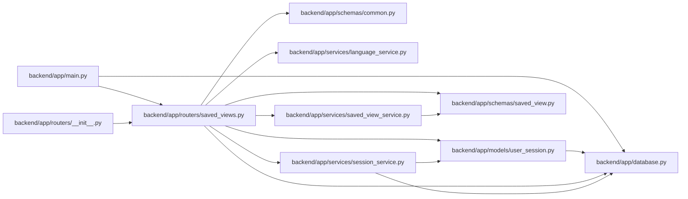

# saved_views Module

**Path:** `backend/app/routers/saved_views.py`

## Description

Saved view API router.

## Imports

| Source | Symbols |
|--------|---------|
| `app.database` | `get_db` |
| `app.models.user_session` | `UserSession` |
| `app.schemas.common` | `MessageResponse` |
| `app.schemas.saved_view` | `SavedViewCreateRequest`, `SavedViewDashboardCardResponse`, `SavedViewDuplicateRequest`, `SavedViewResponse`, `SavedViewType`, `SavedViewUpdateRequest` |
| `app.services` | `session_service` |
| `app.services.language_service` | `backend_error_message`, `entity_deleted_message`, `entity_not_found_message`, `resolve_runtime_ui_language` |
| `app.services.saved_view_service` | `SavedViewPermissionError`, `SavedViewService`, `SavedViewValidationError` |
| `fastapi` | `APIRouter`, `Depends`, `HTTPException`, `Query`, `status` |
| `pydantic` | `ValidationError` |
| `sqlalchemy.ext.asyncio` | `AsyncSession` |
| `typing` | `Annotated`, `NoReturn` |

## Local dependency map

<!-- Auto-generated local dependency summary. Do not edit by hand. -->

### Internal neighbors

| Direction | Module |
|---|---|
| Inbound | [app_main](../modules/app_main.md) |
| Inbound | [routers___init__](../modules/routers___init__.md) |
| Outbound | [app_database](../modules/app_database.md) |
| Outbound | [user_session](../modules/user_session.md) |
| Outbound | [schemas_common](../modules/schemas_common.md) |
| Outbound | [schemas_saved_view](../modules/schemas_saved_view.md) |
| Outbound | [language_service](../modules/language_service.md) |
| Outbound | [saved_view_service](../modules/saved_view_service.md) |
| Outbound | [session_service](../modules/session_service.md) |

### External packages

| Language | Used packages | Undeclared packages |
|---|---:|---:|
| python | 3 | 0 |

## Functions

| Function | Signature | Decorators | Description |
|----------|-----------|------------|-------------|
| `get_saved_view_service` | *(async)* `(db: Annotated[AsyncSession, Depends(get_db)]) -> SavedViewService` | — | Dependency for saved view service. |
| `raise_saved_view_http_error` | *(async)* `(service: SavedViewService, exc: Exception) -> NoReturn` | — | Map service/schema errors to saved-view API responses. |
| `list_saved_views` | *(async)* `(service: Annotated[SavedViewService, Depends(get_saved_view_service)], current_session: Annotated[UserSession, Depends(session_service.get_current_session)], view_type: Annotated[SavedViewType, Query()])` | `@router.get('/saved-views', response_model=list[SavedViewResponse])` | List saved views visible to the current session. |
| `create_saved_view` | *(async)* `(data: SavedViewCreateRequest, service: Annotated[SavedViewService, Depends(get_saved_view_service)], current_session: Annotated[UserSession, Depends(session_service.get_current_session)])` | `@router.post('/saved-views', response_model=SavedViewResponse, status_code=status.HTTP_201_CREATED)` | Create a user-owned saved view. |
| `list_saved_view_dashboard_cards` | *(async)* `(service: Annotated[SavedViewService, Depends(get_saved_view_service)], current_session: Annotated[UserSession, Depends(session_service.get_current_session)], iteration_id: Annotated[int, Query(ge=1)])` | `@router.get('/saved-views/dashboard-cards', response_model=list[SavedViewDashboardCardResponse])` | List saved-view-backed dashboard cards for the selected iteration. |
| `get_saved_view` | *(async)* `(view_id: int, service: Annotated[SavedViewService, Depends(get_saved_view_service)], current_session: Annotated[UserSession, Depends(session_service.get_current_session)])` | `@router.get('/saved-views/{view_id}', response_model=SavedViewResponse)` | Get a saved view visible to the current session. |
| `update_saved_view` | *(async)* `(view_id: int, data: SavedViewUpdateRequest, service: Annotated[SavedViewService, Depends(get_saved_view_service)], current_session: Annotated[UserSession, Depends(session_service.get_current_session)])` | `@router.put('/saved-views/{view_id}', response_model=SavedViewResponse)` | Update a saved view owned by the current session. |
| `delete_saved_view` | *(async)* `(view_id: int, service: Annotated[SavedViewService, Depends(get_saved_view_service)], current_session: Annotated[UserSession, Depends(session_service.get_current_session)])` | `@router.delete('/saved-views/{view_id}', response_model=MessageResponse)` | Delete a saved view owned by the current session. |
| `duplicate_saved_view` | *(async)* `(view_id: int, data: SavedViewDuplicateRequest, service: Annotated[SavedViewService, Depends(get_saved_view_service)], current_session: Annotated[UserSession, Depends(session_service.get_current_session)])` | `@router.post('/saved-views/{view_id}/duplicate', response_model=SavedViewResponse, status_code=status.HTTP_201_CREATED)` | Duplicate any valid visible saved view into a user-owned copy. |
