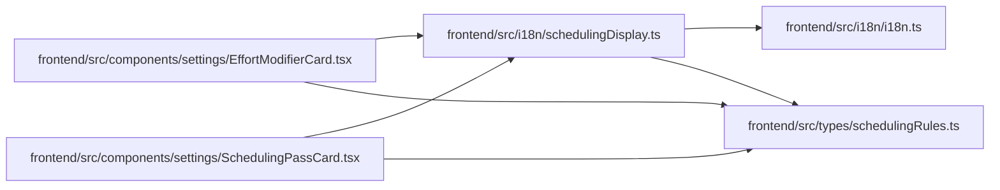

# schedulingDisplay Module

**Path:** `frontend/src/i18n/schedulingDisplay.ts`

## Description

_Auto-generated from `frontend/src/i18n/schedulingDisplay.ts`._

## Imports

| Source | Symbols |
|--------|---------|
| `../types/schedulingRules` | `EffortModifier`, `SchedulingPass`, `SortCriterion` |
| `./i18n` | `i18n` |

## Module Signals

| Signal | Values |
|--------|--------|
| Exports | `effortModifierDisplay`, `schedulingPassDisplay` |
| Constants | `defaultEffortModifiers`, `defaultSchedulingPasses` |

## Local dependency map

<!-- Auto-generated local dependency summary. Do not edit by hand. -->

### Internal neighbors

| Direction | Module |
|---|---|
| Inbound | [EffortModifierCard](../modules/EffortModifierCard.md) |
| Inbound | [SchedulingPassCard](../modules/SchedulingPassCard.md) |
| Outbound | [i18n](../modules/i18n.md) |
| Outbound | [schedulingRules](../modules/schedulingRules.md) |

## Functions

| Function | Signature | Decorators | Description |
|----------|-----------|------------|-------------|
| `effortModifierDisplay` | `(modifier: EffortModifier)` | — | — |
| `schedulingPassDisplay` | `(pass: SchedulingPass)` | — | — |
