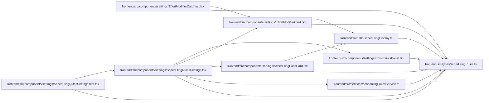

# schedulingRules Module

**Path:** `frontend/src/types/schedulingRules.ts`

## Description

/**
 * Scheduling Rules Types
 * Mirrors backend SchedulingRulesSchema structure
 */

## Module Signals

| Signal | Values |
|--------|--------|
| Exports | `ASSIGNEE_FIELDS`, `BalanceWorkload`, `Constraints`, `EffortModifier`, `FILTER_FIELDS`, `FILTER_VALUES`, `FORMULA_ASSIGNEE_FIELDS`, `FORMULA_TEMPLATES`, `FilterConfig`, `MATH_OPERATIONS`, `OPERATORS`, `SchedulingPass`, `SchedulingRules`, `SchedulingRulesResponse`, `SortCriterion`, `TASK_FIELDS` |
| Constants | `TASK_FIELDS`, `ASSIGNEE_FIELDS`, `OPERATORS`, `MATH_OPERATIONS`, `FILTER_FIELDS`, `FILTER_VALUES`, `FORMULA_TEMPLATES`, `FORMULA_ASSIGNEE_FIELDS` |

## Local dependency map

<!-- Auto-generated local dependency summary. Do not edit by hand. -->

### Internal neighbors

| Direction | Module |
|---|---|
| Inbound | [ConstraintsPanel](../modules/ConstraintsPanel.md) |
| Inbound | [EffortModifierCard.test](../modules/EffortModifierCard.test.md) |
| Inbound | [EffortModifierCard](../modules/EffortModifierCard.md) |
| Inbound | [SchedulingPassCard](../modules/SchedulingPassCard.md) |
| Inbound | [SchedulingRulesSettings.test](../modules/SchedulingRulesSettings.test.md) |
| Inbound | [SchedulingRulesSettings](../modules/SchedulingRulesSettings.md) |
| Inbound | [schedulingDisplay](../modules/schedulingDisplay.md) |
| Inbound | [schedulingRulesService](../modules/schedulingRulesService.md) |

## Classes

| Class | Kind | Line | Bases / Target | Description |
|-------|------|------|----------------|-------------|
| [SortCriterion](../entities/schedulingRules_SortCriterion.md) | Class | 6 | — | Scheduling Rules Types |
| [FilterConfig](../entities/FilterConfig.md) | Class | 11 | — | — |
| [SchedulingPass](../entities/schedulingRules_SchedulingPass.md) | Class | 15 | — | — |
| [EffortModifier](../entities/schedulingRules_EffortModifier.md) | Class | 23 | — | — |
| [BalanceWorkload](../entities/BalanceWorkload.md) | Class | 32 | — | — |
| [Constraints](../entities/schedulingRules_Constraints.md) | Class | 37 | — | — |
| [SchedulingRules](../entities/schedulingRules_SchedulingRules.md) | Class | 46 | — | — |
| [SchedulingRulesResponse](../entities/schedulingRules_SchedulingRulesResponse.md) | Class | 53 | — | — |
