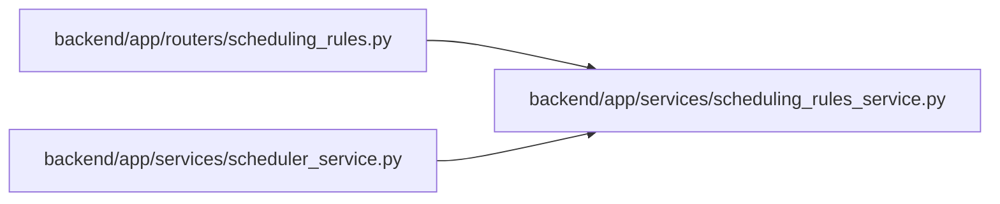

# scheduling_rules_service Module

**Path:** `backend/app/services/scheduling_rules_service.py`

## Description

Scheduling Rules Service - loads and evaluates YAML-based scheduling rules.

## Imports

| Source | Symbols |
|--------|---------|
| `ast` | `ast` |
| `dataclasses` | `dataclass`, `field` |
| `datetime` | `date` |
| `logging` | `logging` |
| `math` | `math` |
| `operator` | `operator` |
| `pathlib` | `Path` |
| `re` | `re` |
| `typing` | `Any`, `Callable`, `Optional` |
| `yaml` | `yaml` |

## Local dependency map

<!-- Auto-generated local dependency summary. Do not edit by hand. -->

### Internal neighbors

| Direction | Module |
|---|---|
| Inbound | [routers_scheduling_rules](../modules/routers_scheduling_rules.md) |
| Inbound | [scheduler_service](../modules/scheduler_service.md) |

### External packages

| Language | Used packages | Undeclared packages |
|---|---:|---:|
| python | 1 | 0 |

## Classes

| Class | Line | Bases | Description |
|-------|------|-------|-------------|
| [SortCriterion](../entities/scheduling_rules_service_SortCriterion.md) | 36 | — | A single sort criterion. |
| [SchedulingPass](../entities/scheduling_rules_service_SchedulingPass.md) | 43 | — | A scheduling pass with filter and sort rules. |
| [EffortModifier](../entities/scheduling_rules_service_EffortModifier.md) | 53 | — | An effort modifier rule. |
| [Constraints](../entities/scheduling_rules_service_Constraints.md) | 64 | — | Scheduling constraints. |
| [SchedulingRules](../entities/scheduling_rules_service_SchedulingRules.md) | 75 | — | Complete scheduling rules configuration. |
| [SchedulingRulesService](../entities/SchedulingRulesService.md) | 83 | — | Service for loading and evaluating scheduling rules from YAML. |
