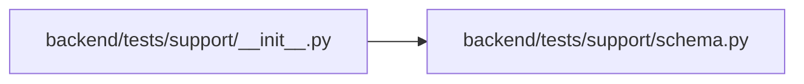

# schema Module

**Path:** `backend/tests/support/schema.py`

## Description

Stable schema snapshots for the SQLite/PostgreSQL migration matrix.

## Imports

| Source | Symbols |
|--------|---------|
| `__future__` | `annotations` |
| `sqlalchemy` | `inspect` |
| `sqlalchemy.engine` | `Connection`, `Engine` |
| `typing` | `Any` |

## Local dependency map

<!-- Auto-generated local dependency summary. Do not edit by hand. -->

### Internal neighbors

| Direction | Module |
|---|---|
| Inbound | [support___init__](../modules/support___init__.md) |

### External packages

| Language | Used packages | Undeclared packages |
|---|---:|---:|
| python | 1 | 0 |

## Functions

| Function | Signature | Decorators | Description |
|----------|-----------|------------|-------------|
| `_type_contract` | `(column_type: Any) -> dict[str, Any]` | — | — |
| `schema_snapshot` | `(bind: Connection \| Engine) -> dict[str, Any]` | — | Return deterministic live schema facts without dialect object reprs. |
| `cross_dialect_schema_diff` | `(sqlite_snapshot: dict[str, Any], postgresql_snapshot: dict[str, Any]) -> dict[str, Any]` | — | Describe only reviewed physical differences between logical schemas. |
