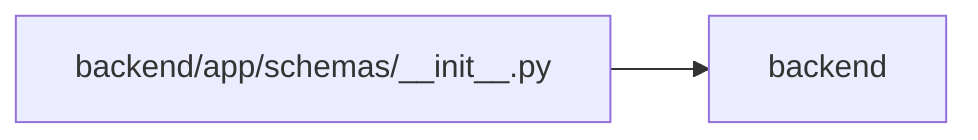

# __init__ Module

**Path:** `backend/app/schemas/__init__.py`

## Description

Schemas package.

## Imports

| Source | Symbols |
|--------|---------|
| `app.schemas.calendar` | `CalendarCreate`, `CalendarUpdate`, `CalendarResponse`, `CalendarImportError`, `CalendarImportRequest`, `CalendarImportResponse`, `WorkingDaysRequest`, `WorkingDaysResponse`, `HolidayImportRequest` |
| `app.schemas.common` | `ErrorResponse`, `MessageResponse` |
| `app.schemas.external_link` | `ExternalLinkCreate`, `ExternalLinkEntityType`, `ExternalLinkProvider`, `ExternalLinkResponse`, `ExternalLinkUpdate`, `GitHubExternalLinkCreate`, `TaskExternalLinkCreate` |
| `app.schemas.gantt` | `GanttMilestone`, `GanttTask`, `GanttResponse`, `SchedulingDecision`, `ScheduleResult` |
| `app.schemas.github` | `GitHubStatusAutomationResult`, `GitHubStatusAutomationRuleCreate`, `GitHubStatusAutomationRuleResponse`, `GitHubStatusAutomationRuleUpdate`, `GitHubWebhookResponse` |
| `app.schemas.intake` | `WebIntakeRateLimitInfo`, `WebIntakeRequest` |
| `app.schemas.iteration` | `IterationCreate`, `IterationSeriesCreate`, `IterationSeriesResponse`, `IterationSeriesStop`, `IterationUpdate`, `IterationResponse`, `IterationSummary` |
| `app.schemas.label` | `LabelCreate`, `LabelGroupBrief`, `LabelGroupCreate`, `LabelGroupResponse`, `LabelGroupUpdate`, `LabelResponse`, `LabelUpdate` |
| `app.schemas.llm` | `FormalizeRequest`, `FormalizeResponse`, `GroundedAISuggestionResponse`, `GroundedFact`, `TaskAISuggestRequest`, `ImproveDescriptionRequest`, `ImproveDescriptionResponse`, `ExplainScheduleRequest`, `ExplainScheduleResponse` |
| `app.schemas.outbound_webhook` | `OutboundWebhookDeliveryResponse`, `OutboundWebhookEventResponse`, `OutboundWebhookRetryResponse`, `OutboundWebhookTargetCreate`, `OutboundWebhookTargetResponse`, `OutboundWebhookTargetUpdate` |
| `app.schemas.project` | `InitiativeCreate`, `InitiativeResponse`, `InitiativeUpdate`, `ProjectCreate`, `ProjectUpdate`, `ProjectResponse`, `ProjectPortfolioSummary`, `ProjectSummary`, `ProjectInitiativeSummary`, `ProjectStatus`, `ProjectHealth`, `ProjectTargetDateRisk`, `ProjectUpdateEntryCreate`, `ProjectUpdateEntryResponse`, `ProjectUpdateFreshness`, `ProjectMilestoneCreate`, `ProjectMilestoneCreateRequest`, `ProjectMilestoneDeleteResponse`, `ProjectMilestoneResponse`, `ProjectMilestoneStatus`, `ProjectMilestoneSummary`, `ProjectMilestoneTaskGroup`, `ProjectMilestoneUpdate`, `RoadmapMilestonePage` |
| `app.schemas.release` | `ReleaseCreate`, `ReleaseCreateRequest`, `ReleaseResponse`, `ReleaseStatus`, `ReleaseTaskSummary`, `ReleaseUpdate`, `ReleaseUpdateRequest` |
| `app.schemas.request_source` | `RequestSourceCreate`, `RequestSourceLinkCreate`, `RequestSourceLinkCreateRequest`, `RequestSourceLinkResponse`, `RequestSourceLinkWithSourceResponse`, `RequestSourceResponse`, `RequestSourceTargetType`, `RequestSourceType`, `RequestSourceUpdate` |
| `app.schemas.saved_view` | `SavedViewCreate`, `SavedViewCreateRequest`, `SavedViewDashboardCardResponse`, `SavedViewDuplicateRequest`, `SavedViewResponse`, `SavedViewScope`, `SavedViewType`, `SavedViewUpdate`, `SavedViewUpdateRequest` |
| `app.schemas.system_settings` | `AppRuntimeSettingsResponse`, `AppRuntimeSettingsUpdate`, `GitHubRuntimeSettingsResponse`, `GitHubRuntimeSettingsUpdate`, `LLMRuntimeSettingsResponse`, `LLMRuntimeSettingsUpdate`, `RestartRequiredSetting`, `RuntimeSecretField`, `RuntimeSettingField`, `RuntimeSettingSource`, `SystemSettingsResponse`, `WebIntakeRuntimeSettingsResponse`, `WebIntakeRuntimeSettingsUpdate` |
| `app.schemas.task` | `TaskAgentReadiness`, `TaskAgentReadinessCriterion`, `TaskBulkOperationRequest`, `TaskBulkOperationResponse`, `TaskBulkOperationResult`, `TaskCreate`, `TaskDependencyCreate`, `TaskImportTriageItemResponse`, `TaskMilestone`, `TaskProject`, `TaskMoveRequest`, `TaskResponse`, `TaskStatus`, `TaskUpdate`, `TasksImportRequest`, `TasksImportResponse` |
| `app.schemas.team` | `AssigneeRecommendationResponse`, `TeamMemberCreate`, `TeamMemberUpdate`, `TeamMemberResponse`, `TeamMemberProfileCompact`, `TeamMemberProfileCreate`, `TeamMemberProfileResponse`, `TeamMemberProfileSkillCreate`, `TeamMemberProfileSkillResponse`, `TeamMemberProfileSkillUpdate`, `TeamMemberProfileUpdate`, `VacationCreate`, `VacationImportError`, `VacationImportRequest`, `VacationImportResponse`, `VacationResponse`, `MemberCapacity`, `MemberWorkload` |
| `app.schemas.template` | `TemplateType`, `WorkTemplateCreate`, `WorkTemplateResponse`, `WorkTemplateUpdate` |
| `app.schemas.triage` | `TriageClassificationDraft`, `TriageClassificationSuggestionResponse`, `TriageTaskDraftRequest`, `TriageTaskDraftResponse`, `TriageActionRequest`, `TriageConvertToTaskRequest`, `TriageConvertToTaskResponse`, `TriageDuplicateRequest`, `TriageDuplicateSuggestion`, `TriageDuplicateSuggestionsResponse`, `TriageItemCreate`, `TriageItemUpdate`, `TriageItemResponse`, `TriageItemStatus`, `TriageSnoozeRequest` |

## Local dependency map

<!-- Auto-generated local dependency summary. Do not edit by hand. -->

> Module-level dependencies exceed the generated-diagram limits, so the diagram and table below group them by top-level package. Counts report the number of module neighbors in each package.

### Internal neighbors

| Direction | Module |
|---|---|
| Outbound | `backend` (19) |

> All 19 module neighbor(s) are summarized by package because the module-level view exceeds the 12-node limit.
