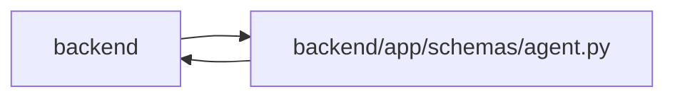

# agent Module

**Path:** `backend/app/schemas/agent.py`

## Description

Agent integration API schemas.

## Imports

| Source | Symbols |
|--------|---------|
| `app.schemas.agent_routing` | `AgentModelBindingResponse` |
| `app.schemas.project` | `ProjectHealth`, `ProjectUpdateEntryResponse` |
| `app.schemas.request_source` | `RequestSourceLinkWithSourceResponse` |
| `app.schemas.task` | `TaskCreate`, `TaskResponse`, `TaskStatus`, `TaskUpdate` |
| `app.schemas.triage` | `TriageItemResponse` |
| `app.services.agent_routing_policy` | `SERVER_OWNED_ROUTING_SNAPSHOT_SCHEMAS`, `assignment_intent`, `validate_routing_packet_size` |
| `app.utils.url_policy` | `URLPolicyError`, `normalize_stored_display_url` |
| `datetime` | `datetime` |
| `json` | `json` |
| `pydantic` | `BaseModel`, `ConfigDict`, `Field`, `field_validator`, `model_validator` |
| `re` | `re` |
| `typing` | `Any`, `Literal`, `Optional` |

## Local dependency map

<!-- Auto-generated local dependency summary. Do not edit by hand. -->

> Module-level dependencies exceed the generated-diagram limits, so the diagram and table below group them by top-level package. Counts report the number of module neighbors in each package.

### Internal neighbors

| Direction | Module |
|---|---|
| Inbound | `backend` (18) |
| Outbound | `backend` (7) |

### External packages

| Language | Used packages | Undeclared packages |
|---|---:|---:|
| python | 1 | 0 |

> All 25 module neighbor(s) are summarized by package because the module-level view exceeds the 12-node limit.

## Classes

| Class | Kind | Line | Bases / Target | Description |
|-------|------|------|----------------|-------------|
| [AgentActorModelBindingCreate](../entities/AgentActorModelBindingCreate.md) | Pydantic model | 107 | `BaseModel` | Secret-free model binding optionally created with a new actor. |
| [AgentActorCreate](../entities/AgentActorCreate.md) | Pydantic model | 145 | `BaseModel` | Request for creating an agent actor. |
| [AgentActorUpdate](../entities/AgentActorUpdate.md) | Pydantic model | 168 | `BaseModel` | Administrative update for a provisioned actor. |
| [AgentActorResponse](../entities/AgentActorResponse.md) | Pydantic model | 209 | `BaseModel` | Agent actor response. |
| [AgentActorCreatedResponse](../entities/AgentActorCreatedResponse.md) | Pydantic model | 226 | `AgentActorResponse` | Agent actor creation response including the one-time API key. |
| [AgentTaskCreate](../entities/AgentTaskCreate.md) | Pydantic model | 235 | `TaskCreate` | Agent task creation request. |
| [AgentTaskPatch](../entities/AgentTaskPatch.md) | Pydantic model | 240 | `TaskUpdate` | Agent task patch request with optimistic concurrency. |
| [TaskClaimRequest](../entities/TaskClaimRequest.md) | Pydantic model | 247 | `BaseModel` | Request to claim or renew a task lease. |
| [TaskClaimResponse](../entities/TaskClaimResponse.md) | Pydantic model | 257 | `BaseModel` | Response for task lease operations. |
| [TaskEventCreate](../entities/TaskEventCreate.md) | Pydantic model | 265 | `BaseModel` | Request to append a task event. |
| [TaskEventResponse](../entities/TaskEventResponse.md) | Pydantic model | 296 | `BaseModel` | Task event response. |
| [AgentRunCreate](../entities/AgentRunCreate.md) | Pydantic model | 311 | `BaseModel` | Request to start an agent run. |
| [AgentRunEventCreate](../entities/AgentRunEventCreate.md) | Pydantic model | 344 | `BaseModel` | Request to append an agent run event. |
| [AgentRunFinish](../entities/AgentRunFinish.md) | Pydantic model | 368 | `BaseModel` | Request to finish an agent run. |
| [AgentRunEventResponse](../entities/AgentRunEventResponse.md) | Pydantic model | 390 | `BaseModel` | Agent run event response. |
| [AgentRunResponse](../entities/AgentRunResponse.md) | Pydantic model | 404 | `BaseModel` | Agent run response. |
| [TaskTimelineItem](../entities/schemas_agent_TaskTimelineItem.md) | Pydantic model | 445 | `BaseModel` | Merged timeline item for a task. |
| [TaskTimelineResponse](../entities/schemas_agent_TaskTimelineResponse.md) | Pydantic model | 456 | `BaseModel` | Merged task timeline response. |
| [AgentPipelineResponse](../entities/AgentPipelineResponse.md) | Pydantic model | 462 | `BaseModel` | Segmented task list representing the agent supervision pipeline board. |
| [AgentRunDetailResponse](../entities/AgentRunDetailResponse.md) | Pydantic model | 474 | `AgentRunResponse` | Full detail of an agent run including its list of chronological trace events. |
| [AgentAssignmentPurpose](../entities/schemas_agent_AgentAssignmentPurpose.md) | Type alias | 481 | `Literal['execution', 'verification']` | — |
| [AgentAssignmentQueueClass](../entities/schemas_agent_AgentAssignmentQueueClass.md) | Type alias | 482 | `Literal['normal', 'rework', 'recovery']` | — |
| [AgentAssignmentState](../entities/schemas_agent_AgentAssignmentState.md) | Type alias | 483 | `Literal['queued', 'accepted', 'fulfilled', 'cancelled']` | — |
| [AgentTaskAssignmentCreate](../entities/AgentTaskAssignmentCreate.md) | Pydantic model | 486 | `BaseModel` | PM command to dispatch a task to an exact actor. |
| [ModelAwareAgentTaskAssignmentCreate](../entities/schemas_agent_ModelAwareAgentTaskAssignmentCreate.md) | Pydantic model | 533 | `BaseModel` | PM command to dispatch one preview-selected actor/model binding. |
| [AgentTaskAssignmentUpdate](../entities/AgentTaskAssignmentUpdate.md) | Pydantic model | 578 | `BaseModel` | PM command to reorder, reassign, or cancel a queued assignment. |
| [ModelAwareAgentTaskAssignmentUpdate](../entities/schemas_agent_ModelAwareAgentTaskAssignmentUpdate.md) | Pydantic model | 592 | `BaseModel` | PM command to reroute queued work through a fresh routing preview. |
| [AgentTaskAssignmentResponse](../entities/AgentTaskAssignmentResponse.md) | Pydantic model | 627 | `BaseModel` | Durable agent task assignment response. |
| [AgentRoutingTopologyReadinessResponse](../entities/AgentRoutingTopologyReadinessResponse.md) | Pydantic model | 657 | `BaseModel` | Bounded server-owned topology readiness exposed to agent clients. |
| [AgentRoutingRolloutStatusResponse](../entities/AgentRoutingRolloutStatusResponse.md) | Pydantic model | 675 | `BaseModel` | Explicit configured and effective model-aware routing rollout state. |
| [AgentCapabilitiesResponse](../entities/AgentCapabilitiesResponse.md) | Pydantic model | 687 | `BaseModel` | Authenticated compatibility and actor capability handshake. |
| [AgentActorRosterProfileSkill](../entities/schemas_agent_AgentActorRosterProfileSkill.md) | Pydantic model | 704 | `BaseModel` | Bounded capability evidence attached to one roster profile. |
| [AgentActorRosterProfile](../entities/schemas_agent_AgentActorRosterProfile.md) | Pydantic model | 717 | `BaseModel` | Secret-free profile projection used for exact-actor routing. |
| [AgentActorRosterItem](../entities/schemas_agent_AgentActorRosterItem.md) | Pydantic model | 730 | `AgentActorResponse` | Secret-free actor dispatch roster item. |
| [AgentDependencyContext](../entities/AgentDependencyContext.md) | Pydantic model | 744 | `BaseModel` | Dependency state returned in complete worker context. |
| [AgentTaskContextResponse](../entities/AgentTaskContextResponse.md) | Pydantic model | 753 | `BaseModel` | Complete task context for an assigned worker. |
| [AgentWorkItem](../entities/AgentWorkItem.md) | Pydantic model | 770 | `BaseModel` | One ordered assigned-work item. |
| [AgentPaginationMetadata](../entities/AgentPaginationMetadata.md) | Pydantic model | 783 | `BaseModel` | Opaque snapshot-bound pagination metadata shared by REST and MCP. |
| [AgentCollectionPageMetadata](../entities/AgentCollectionPageMetadata.md) | Pydantic model | 793 | `BaseModel` | Per-collection counts for compound assigned-work pages. |
| [AgentWorkPaginationMetadata](../entities/AgentWorkPaginationMetadata.md) | Pydantic model | 800 | `AgentPaginationMetadata` | Pagination metadata for ready and blocked assigned-work collections. |
| [AgentWorkDecisionResponse](../entities/AgentWorkDecisionResponse.md) | Pydantic model | 807 | `BaseModel` | Server-authoritative current/next work decision. |
| [AgentReviewQueueResponse](../entities/AgentReviewQueueResponse.md) | Pydantic model | 825 | `BaseModel` | Paginated verifier queue projection. |
| [AgentWorkBegin](../entities/AgentWorkBegin.md) | Pydantic model | 832 | `BaseModel` | Atomically accept and start a server-selected work assignment. |
| [ModelAwareAgentWorkBegin](../entities/ModelAwareAgentWorkBegin.md) | Pydantic model | 853 | `BaseModel` | Atomically begin only the model binding selected by routing. |
| [AgentWorkBeginResponse](../entities/AgentWorkBeginResponse.md) | Pydantic model | 884 | `BaseModel` | Atomic begin result containing all new authoritative state. |
| [AgentWorkRenew](../entities/AgentWorkRenew.md) | Pydantic model | 896 | `BaseModel` | Renew the live fence for one accepted assignment and running run. |
| [AgentWorkSubmit](../entities/AgentWorkSubmit.md) | Pydantic model | 909 | `BaseModel` | Atomically submit an active assignment for verification. |
| [AgentWorkTerminal](../entities/AgentWorkTerminal.md) | Pydantic model | 945 | `BaseModel` | Atomically fail or cancel an active assignment. |
| [AgentWorkTerminalResponse](../entities/AgentWorkTerminalResponse.md) | Pydantic model | 968 | `BaseModel` | Atomic submit/fail result. |
| [AgentReviewVerdict](../entities/AgentReviewVerdict.md) | Pydantic model | 977 | `BaseModel` | Verifier-scoped pass or rejection command. |
| [AgentReviewVerdictResponse](../entities/AgentReviewVerdictResponse.md) | Pydantic model | 999 | `BaseModel` | Verification result plus optional rework assignment. |
| [AgentRecoveryRequeue](../entities/AgentRecoveryRequeue.md) | Pydantic model | 1007 | `BaseModel` | PM command to replace stale execution ownership with recovery work. |
| [AgentRecoveryItem](../entities/AgentRecoveryItem.md) | Pydantic model | 1021 | `BaseModel` | Typed PM recovery diagnosis and optimistic ownership tuple. |
| [AgentRecoveryListResponse](../entities/AgentRecoveryListResponse.md) | Pydantic model | 1036 | `BaseModel` | Paginated PM recovery projection. |
| [AgentRecoveryRequeueResponse](../entities/AgentRecoveryRequeueResponse.md) | Pydantic model | 1043 | `BaseModel` | Authoritative result of stale-work reconciliation and requeue. |
| [AgentProjectUpdateCreate](../entities/AgentProjectUpdateCreate.md) | Pydantic model | 1052 | `BaseModel` | Agent-authored append-only project status report. |
| [AgentProjectUpdateResponse](../entities/AgentProjectUpdateResponse.md) | Pydantic model | 1076 | `ProjectUpdateEntryResponse` | Agent project-update response with attribution and evidence. |
| [AgentDiscoveryTriageCreate](../entities/AgentDiscoveryTriageCreate.md) | Pydantic model | 1080 | `BaseModel` | Claim-bound report of work discovered outside the assigned scope. |
| [AgentDiscoveryTriageResponse](../entities/AgentDiscoveryTriageResponse.md) | Pydantic model | 1105 | `TriageItemResponse` | Created discovery Triage item with source linkage metadata. |

## Functions

| Function | Signature | Decorators | Description |
|----------|-----------|------------|-------------|
| `_validate_actor_scopes` | `(value: list[str]) -> list[str]` | — | — |
| `_validate_bounded_json` | `(value: dict[str, Any], *, label: str) -> dict[str, Any]` | — | Reject persistence packets that can amplify storage and webhook payloads. |
| `_normalize_optional_url` | `(value: Optional[str]) -> Optional[str]` | — | — |
| `_normalize_url_list` | `(values: list[str]) -> list[str]` | — | — |
