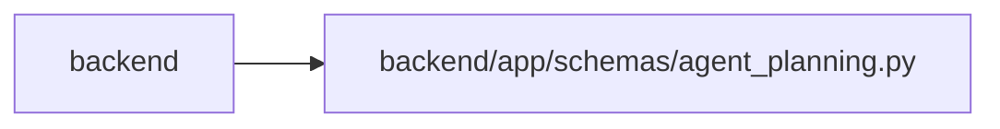

# agent_planning Module

**Path:** `backend/app/schemas/agent_planning.py`

## Description

Schemas for idempotent, agent-authenticated PM setup commands.

## Imports

| Source | Symbols |
|--------|---------|
| `datetime` | `date` |
| `pydantic` | `BaseModel`, `ConfigDict`, `Field`, `field_validator` |
| `typing` | `Any` |

## Local dependency map

<!-- Auto-generated local dependency summary. Do not edit by hand. -->

> Module-level dependencies exceed the generated-diagram limits, so the diagram and table below group them by top-level package. Counts report the number of module neighbors in each package.

### Internal neighbors

| Direction | Module |
|---|---|
| Inbound | `backend` (14) |

### External packages

| Language | Used packages | Undeclared packages |
|---|---:|---:|
| python | 1 | 0 |

> All 14 module neighbor(s) are summarized by package because the module-level view exceeds the 12-node limit.

## Classes

| Class | Line | Bases | Description |
|-------|------|-------|-------------|
| [AgentPlanningCommandContext](../entities/AgentPlanningCommandContext.md) | 9 | `BaseModel` | Required audit metadata carried by every PM setup command. |
| [AgentPlanningReceipt](../entities/AgentPlanningReceipt.md) | 31 | `BaseModel` | Exact durable response stored for one PM setup mutation. |
| [AgentScheduleCommand](../entities/AgentScheduleCommand.md) | 46 | `BaseModel` | Optimistic scheduling command bound to observed task versions. |
| [AgentScheduleTaskState](../entities/AgentScheduleTaskState.md) | 70 | `BaseModel` | One task state produced by schedule preview or apply. |
| [AgentScheduleResult](../entities/AgentScheduleResult.md) | 80 | `BaseModel` | Schedule outcome plus the complete optimistic task-version token set. |
