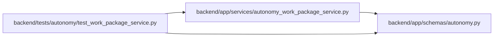

# autonomy Module

**Path:** `backend/app/schemas/autonomy.py`

## Description

Bounded schemas for autonomous work-package and verifier lifecycles.

## Imports

| Source | Symbols |
|--------|---------|
| `__future__` | `annotations` |
| `datetime` | `datetime` |
| `pydantic` | `BaseModel`, `ConfigDict`, `Field`, `field_validator`, `model_validator` |
| `typing` | `Literal` |

## Local dependency map

<!-- Auto-generated local dependency summary. Do not edit by hand. -->

### Internal neighbors

| Direction | Module |
|---|---|
| Inbound | [autonomy_work_package_service](../modules/autonomy_work_package_service.md) |
| Inbound | [test_work_package_service](../modules/test_work_package_service.md) |

### External packages

| Language | Used packages | Undeclared packages |
|---|---:|---:|
| python | 1 | 0 |

## Classes

| Class | Line | Bases | Description |
|-------|------|-------|-------------|
| [AutonomySchema](../entities/AutonomySchema.md) | 15 | `BaseModel` | — |
| [VerificationRequirementCreate](../entities/VerificationRequirementCreate.md) | 19 | `AutonomySchema` | — |
| [AgentWorkPackageCreate](../entities/AgentWorkPackageCreate.md) | 34 | `AutonomySchema` | — |
| [ResolvedVerifierLease](../entities/ResolvedVerifierLease.md) | 63 | `AutonomySchema` | Result of resolving an external signed action lease before service entry. |
| [VerificationClaimRequest](../entities/VerificationClaimRequest.md) | 86 | `AutonomySchema` | — |
| [VerificationBeginRequest](../entities/VerificationBeginRequest.md) | 94 | `AutonomySchema` | — |
| [VerificationRenewRequest](../entities/VerificationRenewRequest.md) | 103 | `AutonomySchema` | — |
| [VerificationCriterionResult](../entities/VerificationCriterionResult.md) | 111 | `AutonomySchema` | — |
| [VerificationSubmitRequest](../entities/VerificationSubmitRequest.md) | 118 | `AutonomySchema` | — |
| [VerificationRequirementResponse](../entities/VerificationRequirementResponse.md) | 141 | `AutonomySchema` | — |
| [AgentWorkPackageResponse](../entities/AgentWorkPackageResponse.md) | 166 | `AutonomySchema` | — |
| [VerificationTransitionResponse](../entities/VerificationTransitionResponse.md) | 185 | `AutonomySchema` | — |
