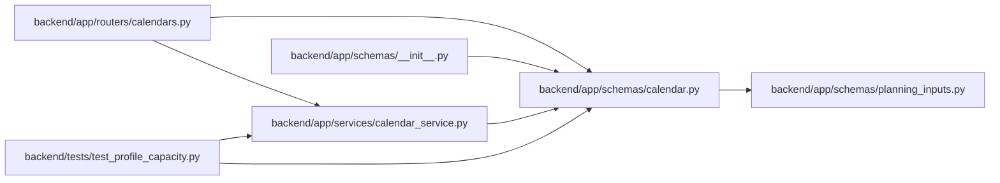

# calendar Module

**Path:** `backend/app/schemas/calendar.py`

## Description

Calendar schemas.

## Imports

| Source | Symbols |
|--------|---------|
| `app.schemas.planning_inputs` | `PlanningInputRevisions`, `WorkingZone` |
| `datetime` | `date` |
| `pydantic` | `BaseModel`, `Field` |
| `typing` | `Optional` |

## Local dependency map

<!-- Auto-generated local dependency summary. Do not edit by hand. -->

### Internal neighbors

| Direction | Module |
|---|---|
| Inbound | [calendars](../modules/calendars.md) |
| Inbound | [schemas___init__](../modules/schemas___init__.md) |
| Inbound | [calendar_service](../modules/calendar_service.md) |
| Inbound | [test_profile_capacity](../modules/test_profile_capacity.md) |
| Outbound | [planning_inputs](../modules/planning_inputs.md) |

### External packages

| Language | Used packages | Undeclared packages |
|---|---:|---:|
| python | 1 | 0 |

## Classes

| Class | Line | Bases | Description |
|-------|------|-------|-------------|
| [CalendarCreate](../entities/schemas_calendar_CalendarCreate.md) | 10 | `PlanningInputRevisions` | Schema for creating a calendar. |
| [CalendarUpdate](../entities/schemas_calendar_CalendarUpdate.md) | 22 | `PlanningInputRevisions` | Schema for updating a calendar. |
| [CalendarResponse](../entities/CalendarResponse.md) | 34 | `BaseModel` | Schema for calendar response. |
| [CalendarImportError](../entities/schemas_calendar_CalendarImportError.md) | 50 | `BaseModel` | One calendar import row that could not be applied. |
| [CalendarImportRequest](../entities/CalendarImportRequest.md) | 56 | `BaseModel` | Request for importing calendar holidays from a public source or CSV text. |
| [CalendarImportResponse](../entities/schemas_calendar_CalendarImportResponse.md) | 64 | `BaseModel` | Summary of imported calendar holidays. |
| [WorkingDaysRequest](../entities/WorkingDaysRequest.md) | 72 | `BaseModel` | Request for calculating working days. |
| [WorkingDaysResponse](../entities/schemas_calendar_WorkingDaysResponse.md) | 78 | `BaseModel` | Response with working days calculation. |
| [HolidayImportRequest](../entities/HolidayImportRequest.md) | 88 | `BaseModel` | Request for importing holidays from external source. |
