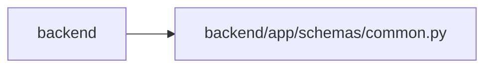

# common Module

**Path:** `backend/app/schemas/common.py`

## Description

Common schemas and error handling.

## Imports

| Source | Symbols |
|--------|---------|
| `pydantic` | `BaseModel` |

## Local dependency map

<!-- Auto-generated local dependency summary. Do not edit by hand. -->

> Module-level dependencies exceed the generated-diagram limits, so the diagram and table below group them by top-level package. Counts report the number of module neighbors in each package.

### Internal neighbors

| Direction | Module |
|---|---|
| Inbound | `backend` (16) |

### External packages

| Language | Used packages | Undeclared packages |
|---|---:|---:|
| python | 1 | 0 |

> All 16 module neighbor(s) are summarized by package because the module-level view exceeds the 12-node limit.

## Classes

| Class | Line | Bases | Description |
|-------|------|-------|-------------|
| [ErrorDetail](../entities/ErrorDetail.md) | 5 | `BaseModel` | Detail of validation error. |
| [ErrorResponse](../entities/ErrorResponse.md) | 11 | `BaseModel` | Standard error response. |
| [MessageResponse](../entities/MessageResponse.md) | 18 | `BaseModel` | Simple message response. |
