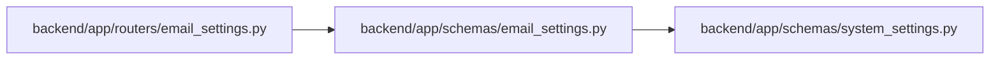

# email_settings Module

**Path:** `backend/app/schemas/email_settings.py`

## Description

Email settings schemas.

## Imports

| Source | Symbols |
|--------|---------|
| `app.schemas.system_settings` | `RuntimeSettingSource` |
| `pydantic` | `BaseModel`, `EmailStr`, `Field` |

## Local dependency map

<!-- Auto-generated local dependency summary. Do not edit by hand. -->

### Internal neighbors

| Direction | Module |
|---|---|
| Inbound | [routers_email_settings](../modules/routers_email_settings.md) |
| Outbound | [schemas_system_settings](../modules/schemas_system_settings.md) |

### External packages

| Language | Used packages | Undeclared packages |
|---|---:|---:|
| python | 1 | 0 |

## Classes

| Class | Line | Bases | Description |
|-------|------|-------|-------------|
| [EmailSettingsUpdate](../entities/schemas_email_settings_EmailSettingsUpdate.md) | 7 | `BaseModel` | Schema for updating email settings. |
| [EmailSettingsResponse](../entities/EmailSettingsResponse.md) | 20 | `BaseModel` | Schema for email settings response (password masked). |
| [TestEmailRequest](../entities/schemas_email_settings_TestEmailRequest.md) | 32 | `BaseModel` | Schema for test email request. |
| [TestEmailResponse](../entities/schemas_email_settings_TestEmailResponse.md) | 37 | `BaseModel` | Schema for test email response. |
