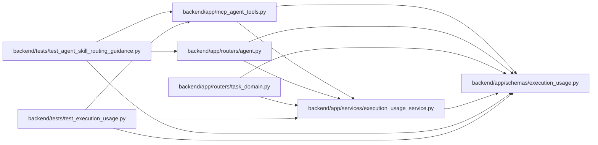

# execution_usage Module

**Path:** `backend/app/schemas/execution_usage.py`

## Description

The contract requires attempt-total semantics, provenance, declared coverage and aware timestamps. Coverage uses one measured-value predicate for quantities, cost and explicit human effort. Complete human-effort-only reports are allowed, including zero; unavailable reports reject all measured values. Unknown counters remain nullable and zero remains zero. Money preserves exact decimal values up to twelve decimal places; optional saved pricing produces estimates. Responses remain unreconciled actor declarations, with simulation values separated from measured totals.

Worker-reported usage, immutable pricing snapshots and explicit coverage.

## Imports

| Source | Symbols |
|--------|---------|
| `datetime` | `datetime` |
| `decimal` | `Decimal` |
| `pydantic` | `AwareDatetime`, `BaseModel`, `ConfigDict`, `Field`, `model_validator` |
| `typing` | `Annotated`, `Literal` |

## Local dependency map

<!-- Auto-generated local dependency summary. Do not edit by hand. -->

### Internal neighbors

| Direction | Module |
|---|---|
| Inbound | [mcp_agent_tools](../modules/mcp_agent_tools.md) |
| Inbound | [routers_agent](../modules/routers_agent.md) |
| Inbound | [routers_task_domain](../modules/routers_task_domain.md) |
| Inbound | [execution_usage_service](../modules/execution_usage_service.md) |
| Inbound | [test_agent_skill_routing_guidance](../modules/test_agent_skill_routing_guidance.md) |
| Inbound | [test_execution_usage](../modules/test_execution_usage.md) |

### External packages

| Language | Used packages | Undeclared packages |
|---|---:|---:|
| python | 1 | 0 |

## Classes

| Class | Kind | Line | Bases / Target | Description |
|-------|------|------|----------------|-------------|
| [Quantity](../entities/Quantity.md) | Type alias | 9 | `Annotated[Decimal, Field(ge=0, max_digits=18, decimal_places=6, allow_inf_nan=False)]` | — |
| [Money](../entities/Money.md) | Type alias | 10 | `Annotated[Decimal, Field(ge=0, max_digits=24, decimal_places=12, allow_inf_nan=False)]` | — |
| [UsagePricingBasis](../entities/UsagePricingBasis.md) | Pydantic model | 13 | `BaseModel` | — |
| [ExecutionUsageWrite](../entities/ExecutionUsageWrite.md) | Pydantic model | 24 | `BaseModel` | — |
| [ExecutionUsageResponse](../entities/ExecutionUsageResponse.md) | Pydantic model | 61 | `BaseModel` | — |
| [ExecutionUsageSummary](../entities/schemas_execution_usage_ExecutionUsageSummary.md) | Pydantic model | 74 | `BaseModel` | — |