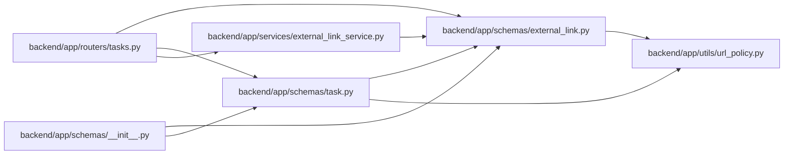

# external_link Module

**Path:** `backend/app/schemas/external_link.py`

## Description

External link schemas.

## Imports

| Source | Symbols |
|--------|---------|
| `app.utils.url_policy` | `URLPolicyError`, `normalize_stored_display_url` |
| `datetime` | `datetime` |
| `enum` | `Enum` |
| `pydantic` | `BaseModel`, `ConfigDict`, `Field`, `field_validator` |
| `typing` | `Any`, `Optional` |

## Local dependency map

<!-- Auto-generated local dependency summary. Do not edit by hand. -->

### Internal neighbors

| Direction | Module |
|---|---|
| Inbound | [tasks](../modules/tasks.md) |
| Inbound | [schemas___init__](../modules/schemas___init__.md) |
| Inbound | [schemas_task](../modules/schemas_task.md) |
| Inbound | [external_link_service](../modules/external_link_service.md) |
| Outbound | [url_policy](../modules/url_policy.md) |

### External packages

| Language | Used packages | Undeclared packages |
|---|---:|---:|
| python | 1 | 0 |

## Classes

| Class | Kind | Line | Bases / Target | Description |
|-------|------|------|----------------|-------------|
| [ExternalLinkEntityType](../entities/schemas_external_link_ExternalLinkEntityType.md) | Enum | 20 | `str`, `Enum` | Supported internal entity types for external links. |
| [ExternalLinkProvider](../entities/schemas_external_link_ExternalLinkProvider.md) | Enum | 27 | `str`, `Enum` | Supported external link providers. |
| [ExternalLinkFields](../entities/ExternalLinkFields.md) | Pydantic model | 36 | `BaseModel` | Shared external link fields. |
| [ExternalLinkCreate](../entities/schemas_external_link_ExternalLinkCreate.md) | Pydantic model | 61 | `ExternalLinkFields` | Schema for creating a generic external link. |
| [TaskExternalLinkCreate](../entities/TaskExternalLinkCreate.md) | Pydantic model | 69 | `ExternalLinkFields` | Schema for creating an external link on a task. |
| [GitHubExternalLinkCreate](../entities/schemas_external_link_GitHubExternalLinkCreate.md) | Pydantic model | 74 | `BaseModel` | Schema for manually linking a GitHub artifact to a task. |
| [ExternalLinkUpdate](../entities/schemas_external_link_ExternalLinkUpdate.md) | Pydantic model | 89 | `BaseModel` | Schema for updating an external link. |
| [ExternalLinkResponse](../entities/ExternalLinkResponse.md) | Pydantic model | 116 | `BaseModel` | Schema for external link responses, including synthetic legacy links. |

## Functions

| Function | Signature | Decorators | Description |
|----------|-----------|------------|-------------|
| `_normalize_optional_url` | `(value: Optional[str]) -> Optional[str]` | — | — |
