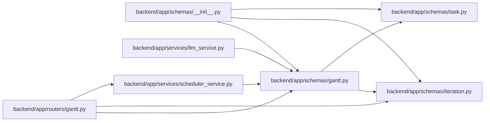

# gantt Module

**Path:** `backend/app/schemas/gantt.py`

## Description

Gantt chart schemas.

## Imports

| Source | Symbols |
|--------|---------|
| `app.schemas.iteration` | `IterationResponse` |
| `app.schemas.task` | `TaskBatchUpdateItem` |
| `datetime` | `date` |
| `pydantic` | `BaseModel` |
| `typing` | `Literal`, `Optional` |

## Local dependency map

<!-- Auto-generated local dependency summary. Do not edit by hand. -->

### Internal neighbors

| Direction | Module |
|---|---|
| Inbound | [routers_gantt](../modules/routers_gantt.md) |
| Inbound | [schemas___init__](../modules/schemas___init__.md) |
| Inbound | [llm_service](../modules/llm_service.md) |
| Inbound | [scheduler_service](../modules/scheduler_service.md) |
| Outbound | [schemas_iteration](../modules/schemas_iteration.md) |
| Outbound | [schemas_task](../modules/schemas_task.md) |

### External packages

| Language | Used packages | Undeclared packages |
|---|---:|---:|
| python | 1 | 0 |

## Classes

| Class | Line | Bases | Description |
|-------|------|-------|-------------|
| [GanttAssignee](../entities/GanttAssignee.md) | 11 | `BaseModel` | Assignee info for Gantt task. |
| [GanttMilestone](../entities/GanttMilestone.md) | 17 | `BaseModel` | Milestone info for Gantt task editing. |
| [GanttTask](../entities/schemas_gantt_GanttTask.md) | 26 | `BaseModel` | Task representation for Gantt chart. |
| [SchedulingDecision](../entities/schemas_gantt_SchedulingDecision.md) | 58 | `BaseModel` | Explanation for a scheduling decision. |
| [WorkloadIssue](../entities/schemas_gantt_WorkloadIssue.md) | 67 | `BaseModel` | Workload issue for a team member. |
| [ScheduleResult](../entities/schemas_gantt_ScheduleResult.md) | 74 | `BaseModel` | Result of scheduling operation. |
| [GanttResponse](../entities/schemas_gantt_GanttResponse.md) | 82 | `BaseModel` | Full Gantt chart response. |
| [SchedulePreviewRequest](../entities/SchedulePreviewRequest.md) | 93 | `BaseModel` | Sandbox edits to dry-run through the real scheduler. |
| [SchedulePreviewResponse](../entities/schemas_gantt_SchedulePreviewResponse.md) | 102 | `BaseModel` | Projected Gantt state after applying changes and rescheduling. |
