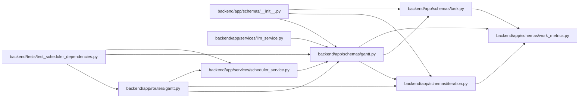

# gantt Module

**Path:** `backend/app/schemas/gantt.py`

## Description

Gantt chart schemas.

## Imports

| Source | Symbols |
|--------|---------|
| `app.schemas.iteration` | `InvertedDependency`, `IterationResponse` |
| `app.schemas.task` | `TaskBatchUpdateItem` |
| `app.schemas.work_metrics` | `TaskMetricSignals` |
| `datetime` | `date` |
| `pydantic` | `BaseModel`, `Field` |
| `typing` | `Literal`, `Optional` |

## Local dependency map

<!-- Auto-generated local dependency summary. Do not edit by hand. -->

```mermaid
flowchart LR
    n0["backend/app/routers/gantt.py"]
    n1["backend/app/schemas/__init__.py"]
    n2["backend/app/schemas/gantt.py"]
    n3["backend/app/schemas/iteration.py"]
    n4["backend/app/schemas/task.py"]
    n5["backend/app/schemas/work_metrics.py"]
    n6["backend/app/services/llm_service.py"]
    n7["backend/app/services/scheduler_service.py"]
    n8["backend/tests/test_scheduler_dependencies.py"]
    n0 --> n2
    n0 --> n3
    n0 --> n7
    n1 --> n2
    n1 --> n3
    n1 --> n4
    n2 --> n3
    n2 --> n4
    n2 --> n5
    n3 --> n5
    n4 --> n5
    n6 --> n2
    n7 --> n2
    n8 --> n0
    n8 --> n2
    n8 --> n7
    click n0 "../modules/routers_gantt.md"
    click n1 "../modules/schemas___init__.md"
    click n2 "../modules/schemas_gantt.md"
    click n3 "../modules/schemas_iteration.md"
    click n4 "../modules/schemas_task.md"
    click n5 "../modules/schemas_work_metrics.md"
    click n6 "../modules/llm_service.md"
    click n7 "../modules/scheduler_service.md"
    click n8 "../modules/test_scheduler_dependencies.md"
```

### Internal neighbors

| Direction | Module |
|---|---|
| Inbound | [routers_gantt](../modules/routers_gantt.md) |
| Inbound | [schemas___init__](../modules/schemas___init__.md) |
| Inbound | [llm_service](../modules/llm_service.md) |
| Inbound | [scheduler_service](../modules/scheduler_service.md) |
| Inbound | [test_scheduler_dependencies](../modules/test_scheduler_dependencies.md) |
| Outbound | [schemas_iteration](../modules/schemas_iteration.md) |
| Outbound | [schemas_task](../modules/schemas_task.md) |
| Outbound | [schemas_work_metrics](../modules/schemas_work_metrics.md) |

### External packages

| Language | Used packages | Undeclared packages |
|---|---:|---:|
| python | 1 | 0 |

## Classes

| Class | Kind | Line | Bases / Target | Description |
|-------|------|------|----------------|-------------|
| [GanttAssignee](../entities/GanttAssignee.md) | Pydantic model | 13 | `BaseModel` | Assignee info for Gantt task. |
| [GanttMilestone](../entities/GanttMilestone.md) | Pydantic model | 23 | `BaseModel` | Milestone info for Gantt task editing. |
| [GanttTask](../entities/schemas_gantt_GanttTask.md) | Pydantic model | 32 | `TaskMetricSignals` | Task representation for Gantt chart. |
| [SchedulingDecision](../entities/schemas_gantt_SchedulingDecision.md) | Pydantic model | 66 | `BaseModel` | Explanation for a scheduling decision. |
| [UnscheduledReason](../entities/schemas_gantt_UnscheduledReason.md) | Type alias | 75 | `Literal['no_assignee', 'assignee_not_in_iteration', 'no_estimate', 'no_capacity', 'prerequisites_pending', 'predecessor_unscheduled', 'deferred', 'blocked', 'not_placed']` | — |
| [DateRule](../entities/schemas_gantt_DateRule.md) | Type alias | 88 | `Literal['dates_incomplete', 'dates_inverted', 'outside_iteration', 'before_min_start_date']` | — |
| [UnscheduledTask](../entities/schemas_gantt_UnscheduledTask.md) | Pydantic model | 96 | `BaseModel` | A planned task the scheduler left without dates, and what would change that. |
| [KeptDatesTask](../entities/schemas_gantt_KeptDatesTask.md) | Pydantic model | 110 | `BaseModel` | A planned task the scheduler could not place; it keeps the dates it already had. |
| [WorkloadIssue](../entities/schemas_gantt_WorkloadIssue.md) | Pydantic model | 124 | `BaseModel` | Workload issue for a team member. |
| [AssignmentSelectionRefresh](../entities/AssignmentSelectionRefresh.md) | Pydantic model | 131 | `BaseModel` | — |
| [ScheduleResult](../entities/schemas_gantt_ScheduleResult.md) | Pydantic model | 140 | `BaseModel` | Result of scheduling operation. |
| [GanttResponse](../entities/schemas_gantt_GanttResponse.md) | Pydantic model | 155 | `BaseModel` | Full Gantt chart response. |
| [ScheduleApplyRequest](../entities/ScheduleApplyRequest.md) | Pydantic model | 168 | `BaseModel` | — |
| [SchedulePreviewRequest](../entities/SchedulePreviewRequest.md) | Pydantic model | 174 | `BaseModel` | Sandbox edits to dry-run through the real scheduler. |
| [SchedulePreviewResponse](../entities/schemas_gantt_SchedulePreviewResponse.md) | Pydantic model | 185 | `BaseModel` | Projected Gantt state after applying changes and rescheduling. |
