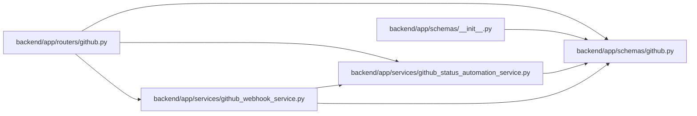

# github Module

**Path:** `backend/app/schemas/github.py`

## Description

GitHub integration schemas.

## Imports

| Source | Symbols |
|--------|---------|
| `datetime` | `datetime` |
| `pydantic` | `BaseModel`, `Field` |
| `typing` | `Literal`, `Optional` |

## Local dependency map

<!-- Auto-generated local dependency summary. Do not edit by hand. -->

### Internal neighbors

| Direction | Module |
|---|---|
| Inbound | [routers_github](../modules/routers_github.md) |
| Inbound | [schemas___init__](../modules/schemas___init__.md) |
| Inbound | [github_status_automation_service](../modules/github_status_automation_service.md) |
| Inbound | [github_webhook_service](../modules/github_webhook_service.md) |

### External packages

| Language | Used packages | Undeclared packages |
|---|---:|---:|
| python | 1 | 0 |

## Classes

| Class | Kind | Line | Bases / Target | Description |
|-------|------|------|----------------|-------------|
| [GitHubAutomationEventType](../entities/schemas_github_GitHubAutomationEventType.md) | Type alias | 7 | `Literal['github_pr_opened', 'github_pr_reopened', 'github_pr_ready_for_review', 'github_pr_synchronize', 'github_pr_closed', 'github_pr_merged']` | — |
| [GitHubAutomationFromStatus](../entities/GitHubAutomationFromStatus.md) | Type alias | 15 | `Literal['planned', 'active', 'resolved', 'closed']` | — |
| [GitHubAutomationTargetStatus](../entities/schemas_github_GitHubAutomationTargetStatus.md) | Type alias | 16 | `Literal['active', 'resolved', 'closed']` | — |
| [GitHubAutomationOutcome](../entities/schemas_github_GitHubAutomationOutcome.md) | Type alias | 17 | `Literal['applied', 'skipped', 'failed']` | — |
| [GitHubStatusAutomationRuleBase](../entities/GitHubStatusAutomationRuleBase.md) | Pydantic model | 20 | `BaseModel` | Shared GitHub status automation rule fields. |
| [GitHubStatusAutomationRuleCreate](../entities/schemas_github_GitHubStatusAutomationRuleCreate.md) | Pydantic model | 33 | `GitHubStatusAutomationRuleBase` | Create a GitHub status automation rule. |
| [GitHubStatusAutomationRuleUpdate](../entities/schemas_github_GitHubStatusAutomationRuleUpdate.md) | Pydantic model | 37 | `BaseModel` | Update a GitHub status automation rule. |
| [GitHubStatusAutomationRuleResponse](../entities/GitHubStatusAutomationRuleResponse.md) | Pydantic model | 50 | `GitHubStatusAutomationRuleBase` | Response for one GitHub status automation rule. |
| [GitHubStatusAutomationResult](../entities/schemas_github_GitHubStatusAutomationResult.md) | Pydantic model | 61 | `BaseModel` | Result of applying one GitHub status automation rule. |
| [GitHubWebhookResponse](../entities/GitHubWebhookResponse.md) | Pydantic model | 72 | `BaseModel` | Response returned after receiving a GitHub webhook delivery. |
