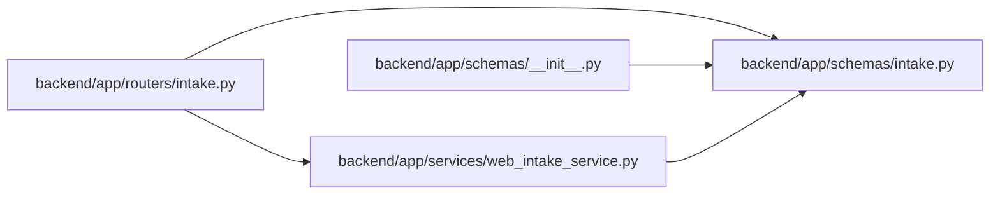

# intake Module

**Path:** `backend/app/schemas/intake.py`

## Description

Schemas for controlled external intake endpoints.

## Imports

| Source | Symbols |
|--------|---------|
| `datetime` | `datetime` |
| `pydantic` | `BaseModel`, `ConfigDict`, `Field`, `field_validator`, `model_validator` |
| `typing` | `Any`, `Optional` |

## Local dependency map

<!-- Auto-generated local dependency summary. Do not edit by hand. -->

### Internal neighbors

| Direction | Module |
|---|---|
| Inbound | [routers_intake](../modules/routers_intake.md) |
| Inbound | [schemas___init__](../modules/schemas___init__.md) |
| Inbound | [web_intake_service](../modules/web_intake_service.md) |

### External packages

| Language | Used packages | Undeclared packages |
|---|---:|---:|
| python | 1 | 0 |

## Classes

| Class | Line | Bases | Description |
|-------|------|-------|-------------|
| [WebIntakeRequest](../entities/WebIntakeRequest.md) | 8 | `BaseModel` | External web/form intake payload. |
| [WebIntakeRateLimitInfo](../entities/WebIntakeRateLimitInfo.md) | 73 | `BaseModel` | Rate-limit details returned on rejection. |
