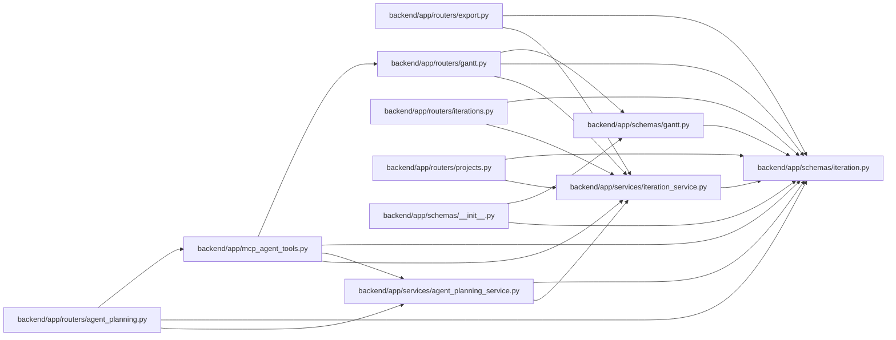

# iteration Module

**Path:** `backend/app/schemas/iteration.py`

## Description

Iteration schemas.

## Imports

| Source | Symbols |
|--------|---------|
| `datetime` | `date` |
| `pydantic` | `BaseModel`, `Field`, `model_validator` |
| `typing` | `Literal`, `Optional` |

## Local dependency map

<!-- Auto-generated local dependency summary. Do not edit by hand. -->

### Internal neighbors

| Direction | Module |
|---|---|
| Inbound | [mcp_agent_tools](../modules/mcp_agent_tools.md) |
| Inbound | [routers_agent_planning](../modules/routers_agent_planning.md) |
| Inbound | [export](../modules/export.md) |
| Inbound | [routers_gantt](../modules/routers_gantt.md) |
| Inbound | [iterations](../modules/iterations.md) |
| Inbound | [projects](../modules/projects.md) |
| Inbound | [schemas___init__](../modules/schemas___init__.md) |
| Inbound | [schemas_gantt](../modules/schemas_gantt.md) |
| Inbound | [agent_planning_service](../modules/agent_planning_service.md) |
| Inbound | [iteration_service](../modules/iteration_service.md) |

### External packages

| Language | Used packages | Undeclared packages |
|---|---:|---:|
| python | 1 | 0 |

## Classes

| Class | Line | Bases | Description |
|-------|------|-------|-------------|
| [IterationCreate](../entities/schemas_iteration_IterationCreate.md) | 8 | `BaseModel` | Schema for creating an iteration. |
| [IterationUpdate](../entities/schemas_iteration_IterationUpdate.md) | 18 | `BaseModel` | Schema for updating an iteration. |
| [IterationSeriesStop](../entities/schemas_iteration_IterationSeriesStop.md) | 28 | `BaseModel` | Stop rule for generating a back-to-back iteration series. |
| [IterationSeriesCreate](../entities/schemas_iteration_IterationSeriesCreate.md) | 44 | `BaseModel` | Schema for creating multiple back-to-back iterations. |
| [IterationProjectSummary](../entities/IterationProjectSummary.md) | 55 | `BaseModel` | Compact project identity embedded in iteration responses. |
| [IterationResponse](../entities/IterationResponse.md) | 66 | `BaseModel` | Schema for iteration response. |
| [IterationSeriesResponse](../entities/schemas_iteration_IterationSeriesResponse.md) | 82 | `BaseModel` | Response returned after creating an iteration series. |
| [IterationSummary](../entities/schemas_iteration_IterationSummary.md) | 87 | `BaseModel` | Summary statistics for an iteration. |
| [IterationPlanningReadinessSummary](../entities/schemas_iteration_IterationPlanningReadinessSummary.md) | 103 | `BaseModel` | Compact planning inputs used by persistent navigation. |
