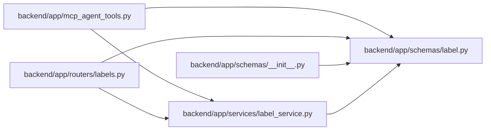

# label Module

**Path:** `backend/app/schemas/label.py`

## Description

Governed label taxonomy schemas.

## Imports

| Source | Symbols |
|--------|---------|
| `datetime` | `datetime` |
| `pydantic` | `BaseModel`, `ConfigDict`, `Field` |
| `typing` | `Optional` |

## Local dependency map

<!-- Auto-generated local dependency summary. Do not edit by hand. -->

### Internal neighbors

| Direction | Module |
|---|---|
| Inbound | [mcp_agent_tools](../modules/mcp_agent_tools.md) |
| Inbound | [labels](../modules/labels.md) |
| Inbound | [schemas___init__](../modules/schemas___init__.md) |
| Inbound | [label_service](../modules/label_service.md) |

### External packages

| Language | Used packages | Undeclared packages |
|---|---:|---:|
| python | 1 | 0 |

## Classes

| Class | Line | Bases | Description |
|-------|------|-------|-------------|
| [LabelGroupCreate](../entities/schemas_label_LabelGroupCreate.md) | 13 | `BaseModel` | Schema for creating a governed label group. |
| [LabelGroupUpdate](../entities/schemas_label_LabelGroupUpdate.md) | 25 | `BaseModel` | Schema for updating a governed label group. |
| [LabelGroupBrief](../entities/schemas_label_LabelGroupBrief.md) | 37 | `BaseModel` | Brief label group shape embedded in label responses. |
| [LabelCreate](../entities/schemas_label_LabelCreate.md) | 48 | `BaseModel` | Schema for creating a governed label. |
| [LabelUpdate](../entities/schemas_label_LabelUpdate.md) | 61 | `BaseModel` | Schema for updating a governed label. |
| [LabelResponse](../entities/LabelResponse.md) | 74 | `BaseModel` | Schema for governed label responses. |
| [LabelGroupResponse](../entities/LabelGroupResponse.md) | 92 | `BaseModel` | Schema for governed label group responses. |
