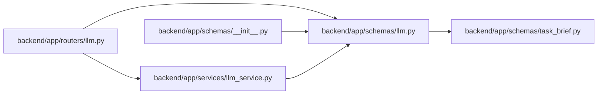

# llm Module

**Path:** `backend/app/schemas/llm.py`

## Description

LLM integration schemas.

## Imports

| Source | Symbols |
|--------|---------|
| `app.schemas.task_brief` | `TaskBrief` |
| `pydantic` | `BaseModel`, `Field` |
| `typing` | `Any`, `Optional` |

## Local dependency map

<!-- Auto-generated local dependency summary. Do not edit by hand. -->

### Internal neighbors

| Direction | Module |
|---|---|
| Inbound | [routers_llm](../modules/routers_llm.md) |
| Inbound | [schemas___init__](../modules/schemas___init__.md) |
| Inbound | [llm_service](../modules/llm_service.md) |
| Outbound | [schemas_task_brief](../modules/schemas_task_brief.md) |

### External packages

| Language | Used packages | Undeclared packages |
|---|---:|---:|
| python | 1 | 0 |

## Classes

| Class | Line | Bases | Description |
|-------|------|-------|-------------|
| [FormalizeRequest](../entities/FormalizeRequest.md) | 6 | `BaseModel` | Request for task formalization via LLM. |
| [FormalizeDraftRequest](../entities/FormalizeDraftRequest.md) | 11 | `BaseModel` | Request for formalizing unsaved task form data. |
| [SuggestedSubtask](../entities/schemas_llm_SuggestedSubtask.md) | 18 | `BaseModel` | Suggested subtask from LLM. |
| [FormalizeResponse](../entities/FormalizeResponse.md) | 24 | `BaseModel` | Response from task formalization. |
| [ImproveDescriptionRequest](../entities/ImproveDescriptionRequest.md) | 34 | `BaseModel` | Request for improving task description. |
| [ImproveDescriptionResponse](../entities/ImproveDescriptionResponse.md) | 40 | `BaseModel` | Response from description improvement. |
| [GroundedFact](../entities/schemas_llm_GroundedFact.md) | 46 | `BaseModel` | Fact or claim tied to an explicit source in the AI context pack. |
| [GroundedAISuggestionResponse](../entities/schemas_llm_GroundedAISuggestionResponse.md) | 53 | `BaseModel` | Advisory AI task draft separated into grounded and suggested parts. |
| [TaskAISuggestRequest](../entities/schemas_llm_TaskAISuggestRequest.md) | 76 | `BaseModel` | Request for grounded advisory task AI suggestions. |
| [ExplainScheduleRequest](../entities/schemas_llm_ExplainScheduleRequest.md) | 103 | `BaseModel` | Request for schedule explanation. |
| [ScheduleDecisionExplanation](../entities/schemas_llm_ScheduleDecisionExplanation.md) | 108 | `BaseModel` | Human-readable explanation for a scheduling decision. |
| [WorkloadAnalysis](../entities/schemas_llm_WorkloadAnalysis.md) | 116 | `BaseModel` | Analysis of team workload. |
| [ExplainScheduleResponse](../entities/schemas_llm_ExplainScheduleResponse.md) | 122 | `BaseModel` | Response with schedule explanation. |
