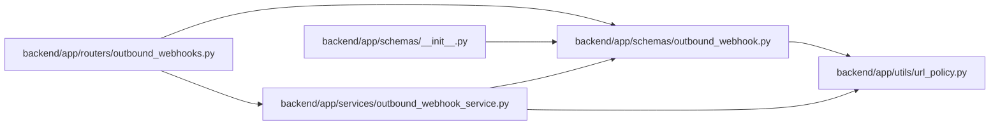

# outbound_webhook Module

**Path:** `backend/app/schemas/outbound_webhook.py`

## Description

Outbound webhook API schemas.

## Imports

| Source | Symbols |
|--------|---------|
| `app.utils.url_policy` | `URLPolicyError`, `normalize_external_http_url` |
| `datetime` | `datetime` |
| `enum` | `Enum` |
| `pydantic` | `BaseModel`, `ConfigDict`, `Field`, `field_validator` |
| `typing` | `Any`, `Optional` |

## Local dependency map

<!-- Auto-generated local dependency summary. Do not edit by hand. -->

### Internal neighbors

| Direction | Module |
|---|---|
| Inbound | [outbound_webhooks](../modules/outbound_webhooks.md) |
| Inbound | [schemas___init__](../modules/schemas___init__.md) |
| Inbound | [outbound_webhook_service](../modules/outbound_webhook_service.md) |
| Outbound | [url_policy](../modules/url_policy.md) |

### External packages

| Language | Used packages | Undeclared packages |
|---|---:|---:|
| python | 1 | 0 |

## Classes

| Class | Kind | Line | Bases / Target | Description |
|-------|------|------|----------------|-------------|
| [OutboundWebhookDeliveryStatus](../entities/schemas_outbound_webhook_OutboundWebhookDeliveryStatus.md) | Enum | 54 | `str`, `Enum` | Delivery states exposed by the outbound webhook API. |
| [OutboundWebhookTargetBase](../entities/OutboundWebhookTargetBase.md) | Pydantic model | 62 | `BaseModel` | Shared target configuration fields. |
| [OutboundWebhookTargetCreate](../entities/schemas_outbound_webhook_OutboundWebhookTargetCreate.md) | Pydantic model | 96 | `OutboundWebhookTargetBase` | Create an outbound webhook target. |
| [OutboundWebhookTargetUpdate](../entities/schemas_outbound_webhook_OutboundWebhookTargetUpdate.md) | Pydantic model | 100 | `BaseModel` | Partial update for an outbound webhook target. |
| [OutboundWebhookTargetResponse](../entities/OutboundWebhookTargetResponse.md) | Pydantic model | 134 | `BaseModel` | Outbound webhook target response without exposing the secret. |
| [OutboundWebhookEventResponse](../entities/OutboundWebhookEventResponse.md) | Pydantic model | 151 | `BaseModel` | Normalized outbound webhook event response. |
| [OutboundWebhookDeliveryResponse](../entities/OutboundWebhookDeliveryResponse.md) | Pydantic model | 165 | `BaseModel` | Delivery attempt response with embedded event details. |
| [OutboundWebhookRetryResponse](../entities/schemas_outbound_webhook_OutboundWebhookRetryResponse.md) | Pydantic model | 191 | `BaseModel` | Response returned by retry and test delivery endpoints. |

## Functions

| Function | Signature | Decorators | Description |
|----------|-----------|------------|-------------|
| `_normalize_url` | `(value: str) -> str` | — | Require public outbound webhook URLs to use HTTP or HTTPS. |
| `_normalize_events` | `(value: list[str]) -> list[str]` | — | Normalize non-empty subscription tokens without duplicates. |
| `_normalize_headers` | `(value: dict[str, Any]) -> dict[str, str]` | — | Restrict custom headers to string key/value pairs. |
| `_normalize_secret` | `(value: Optional[str]) -> Optional[str]` | — | Normalize optional signing secrets. |
