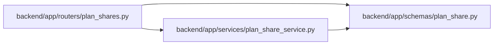

# plan_share Module

**Path:** `backend/app/schemas/plan_share.py`

## Description

Schemas for immutable read-only plan shares.

## Imports

| Source | Symbols |
|--------|---------|
| `datetime` | `datetime` |
| `pydantic` | `BaseModel`, `ConfigDict`, `Field` |
| `typing` | `Any` |

## Local dependency map

<!-- Auto-generated local dependency summary. Do not edit by hand. -->

### Internal neighbors

| Direction | Module |
|---|---|
| Inbound | [plan_shares](../modules/plan_shares.md) |
| Inbound | [plan_share_service](../modules/plan_share_service.md) |

### External packages

| Language | Used packages | Undeclared packages |
|---|---:|---:|
| python | 1 | 0 |

## Classes

| Class | Line | Bases | Description |
|-------|------|-------|-------------|
| [PlanShareResponse](../entities/PlanShareResponse.md) | 9 | `BaseModel` | A revocable plan snapshot link and its immutable captured data. |
