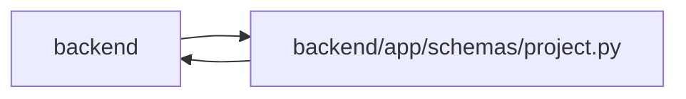

# project Module

**Path:** `backend/app/schemas/project.py`

## Description

Project schemas.

## Imports

| Source | Symbols |
|--------|---------|
| `app.schemas.planning_inputs` | `PlanningInputRevisions`, `WorkingZone` |
| `app.schemas.team` | `TeamMemberOptionResponse`, `TeamMemberProfileCompact` |
| `app.schemas.work_metrics` | `WorkMetricSummary` |
| `datetime` | `date`, `datetime` |
| `enum` | `Enum` |
| `pydantic` | `BaseModel`, `ConfigDict`, `Field` |
| `typing` | `Any`, `Optional` |

## Local dependency map

<!-- Auto-generated local dependency summary. Do not edit by hand. -->

> Module-level dependencies exceed the generated-diagram limits, so the diagram and table below group them by top-level package. Counts report the number of module neighbors in each package.

### Internal neighbors

| Direction | Module |
|---|---|
| Inbound | `backend` (10) |
| Outbound | `backend` (3) |

### External packages

| Language | Used packages | Undeclared packages |
|---|---:|---:|
| python | 1 | 0 |

> All 13 module neighbor(s) are summarized by package because the module-level view exceeds the 12-node limit.

## Classes

| Class | Kind | Line | Bases / Target | Description |
|-------|------|------|----------------|-------------|
| [ProjectStatus](../entities/schemas_project_ProjectStatus.md) | Enum | 15 | `str`, `Enum` | Project lifecycle status. |
| [ProjectHealth](../entities/schemas_project_ProjectHealth.md) | Enum | 25 | `str`, `Enum` | Project delivery health. |
| [ProjectTargetDateRisk](../entities/schemas_project_ProjectTargetDateRisk.md) | Enum | 33 | `str`, `Enum` | Target-date risk for project delivery. |
| [ProjectUpdateFreshness](../entities/schemas_project_ProjectUpdateFreshness.md) | Enum | 41 | `str`, `Enum` | Freshness state for project stakeholder updates. |
| [ProjectMilestoneStatus](../entities/schemas_project_ProjectMilestoneStatus.md) | Enum | 49 | `str`, `Enum` | Explicit lifecycle status for a project milestone. |
| [InitiativeCreate](../entities/schemas_project_InitiativeCreate.md) | Pydantic model | 60 | `BaseModel` | Schema for creating an initiative. |
| [InitiativeUpdate](../entities/schemas_project_InitiativeUpdate.md) | Pydantic model | 72 | `BaseModel` | Schema for updating an initiative. |
| [InitiativeResponse](../entities/InitiativeResponse.md) | Pydantic model | 84 | `BaseModel` | Schema for initiative responses. |
| [ProjectInitiativeSummary](../entities/schemas_project_ProjectInitiativeSummary.md) | Pydantic model | 101 | `BaseModel` | Compact initiative identity embedded in project responses. |
| [ProjectCreate](../entities/schemas_project_ProjectCreate.md) | Pydantic model | 115 | `BaseModel` | Schema for creating a project. |
| [ProjectUpdate](../entities/schemas_project_ProjectUpdate.md) | Pydantic model | 131 | `PlanningInputRevisions` | Schema for updating a project. |
| [ProjectUpdateEntryCreate](../entities/schemas_project_ProjectUpdateEntryCreate.md) | Pydantic model | 148 | `BaseModel` | Schema for creating an append-only project update. |
| [ProjectUpdateEntryResponse](../entities/ProjectUpdateEntryResponse.md) | Pydantic model | 160 | `BaseModel` | Schema for project update responses. |
| [ProjectMilestoneCreate](../entities/ProjectMilestoneCreate.md) | Pydantic model | 180 | `BaseModel` | Schema for creating a project milestone. |
| [ProjectMilestoneCreateRequest](../entities/schemas_project_ProjectMilestoneCreateRequest.md) | Pydantic model | 193 | `BaseModel` | API request for creating a project-scoped milestone. |
| [ProjectMilestoneUpdate](../entities/ProjectMilestoneUpdate.md) | Pydantic model | 205 | `BaseModel` | Schema for updating a project milestone. |
| [ProjectMilestoneResponse](../entities/ProjectMilestoneResponse.md) | Pydantic model | 217 | `BaseModel` | Schema for project milestone responses. |
| [RoadmapMilestonePage](../entities/schemas_project_RoadmapMilestonePage.md) | Pydantic model | 233 | `BaseModel` | Cursor page of milestones used by the portfolio roadmap. |
| [ProjectMilestoneDeleteResponse](../entities/schemas_project_ProjectMilestoneDeleteResponse.md) | Pydantic model | 239 | `BaseModel` | Response returned after deleting a project milestone. |
| [ProjectMilestoneSummary](../entities/schemas_project_ProjectMilestoneSummary.md) | Pydantic model | 246 | `BaseModel` | Compact milestone identity for project task grouping. |
| [ProjectMilestoneTaskGroup](../entities/schemas_project_ProjectMilestoneTaskGroup.md) | Pydantic model | 256 | `WorkMetricSummary` | Task progress metrics grouped under one milestone or unassigned work. |
| [ProjectResponse](../entities/ProjectResponse.md) | Pydantic model | 276 | `BaseModel` | Schema for project response. |
| [ProjectPortfolioSummary](../entities/schemas_project_ProjectPortfolioSummary.md) | Pydantic model | 302 | `WorkMetricSummary` | Compact project signals for portfolio tables. |
| [ProjectSummary](../entities/schemas_project_ProjectSummary.md) | Pydantic model | 314 | `WorkMetricSummary` | Summary statistics for a project. |
| [ProjectPage](../entities/ProjectPage.md) | Pydantic model | 360 | `BaseModel` | — |
| [ProjectPortfolioPage](../entities/ProjectPortfolioPage.md) | Pydantic model | 368 | `BaseModel` | — |
