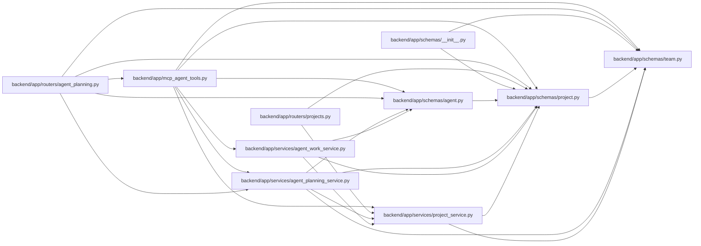

# project Module

**Path:** `backend/app/schemas/project.py`

## Description

Project schemas.

## Imports

| Source | Symbols |
|--------|---------|
| `app.schemas.team` | `TeamMemberOptionResponse`, `TeamMemberProfileCompact` |
| `datetime` | `date`, `datetime` |
| `enum` | `Enum` |
| `pydantic` | `BaseModel`, `ConfigDict`, `Field` |
| `typing` | `Any`, `Optional` |

## Local dependency map

<!-- Auto-generated local dependency summary. Do not edit by hand. -->

### Internal neighbors

| Direction | Module |
|---|---|
| Inbound | [mcp_agent_tools](../modules/mcp_agent_tools.md) |
| Inbound | [routers_agent_planning](../modules/routers_agent_planning.md) |
| Inbound | [projects](../modules/projects.md) |
| Inbound | [schemas___init__](../modules/schemas___init__.md) |
| Inbound | [schemas_agent](../modules/schemas_agent.md) |
| Inbound | [agent_planning_service](../modules/agent_planning_service.md) |
| Inbound | [agent_work_service](../modules/agent_work_service.md) |
| Inbound | [project_service](../modules/project_service.md) |
| Outbound | [schemas_team](../modules/schemas_team.md) |

### External packages

| Language | Used packages | Undeclared packages |
|---|---:|---:|
| python | 1 | 0 |

## Classes

| Class | Kind | Line | Bases / Target | Description |
|-------|------|------|----------------|-------------|
| [ProjectStatus](../entities/schemas_project_ProjectStatus.md) | Enum | 11 | `str`, `Enum` | Project lifecycle status. |
| [ProjectHealth](../entities/schemas_project_ProjectHealth.md) | Enum | 21 | `str`, `Enum` | Project delivery health. |
| [ProjectTargetDateRisk](../entities/schemas_project_ProjectTargetDateRisk.md) | Enum | 29 | `str`, `Enum` | Target-date risk for project delivery. |
| [ProjectUpdateFreshness](../entities/schemas_project_ProjectUpdateFreshness.md) | Enum | 37 | `str`, `Enum` | Freshness state for project stakeholder updates. |
| [ProjectMilestoneStatus](../entities/schemas_project_ProjectMilestoneStatus.md) | Enum | 45 | `str`, `Enum` | Explicit lifecycle status for a project milestone. |
| [InitiativeCreate](../entities/schemas_project_InitiativeCreate.md) | Pydantic model | 56 | `BaseModel` | Schema for creating an initiative. |
| [InitiativeUpdate](../entities/schemas_project_InitiativeUpdate.md) | Pydantic model | 68 | `BaseModel` | Schema for updating an initiative. |
| [InitiativeResponse](../entities/InitiativeResponse.md) | Pydantic model | 80 | `BaseModel` | Schema for initiative responses. |
| [ProjectInitiativeSummary](../entities/schemas_project_ProjectInitiativeSummary.md) | Pydantic model | 97 | `BaseModel` | Compact initiative identity embedded in project responses. |
| [ProjectCreate](../entities/schemas_project_ProjectCreate.md) | Pydantic model | 111 | `BaseModel` | Schema for creating a project. |
| [ProjectUpdate](../entities/schemas_project_ProjectUpdate.md) | Pydantic model | 125 | `BaseModel` | Schema for updating a project. |
| [ProjectUpdateEntryCreate](../entities/schemas_project_ProjectUpdateEntryCreate.md) | Pydantic model | 140 | `BaseModel` | Schema for creating an append-only project update. |
| [ProjectUpdateEntryResponse](../entities/ProjectUpdateEntryResponse.md) | Pydantic model | 152 | `BaseModel` | Schema for project update responses. |
| [ProjectMilestoneCreate](../entities/ProjectMilestoneCreate.md) | Pydantic model | 172 | `BaseModel` | Schema for creating a project milestone. |
| [ProjectMilestoneCreateRequest](../entities/schemas_project_ProjectMilestoneCreateRequest.md) | Pydantic model | 185 | `BaseModel` | API request for creating a project-scoped milestone. |
| [ProjectMilestoneUpdate](../entities/ProjectMilestoneUpdate.md) | Pydantic model | 197 | `BaseModel` | Schema for updating a project milestone. |
| [ProjectMilestoneResponse](../entities/ProjectMilestoneResponse.md) | Pydantic model | 209 | `BaseModel` | Schema for project milestone responses. |
| [RoadmapMilestonePage](../entities/schemas_project_RoadmapMilestonePage.md) | Pydantic model | 225 | `BaseModel` | Cursor page of milestones used by the portfolio roadmap. |
| [ProjectMilestoneDeleteResponse](../entities/schemas_project_ProjectMilestoneDeleteResponse.md) | Pydantic model | 231 | `BaseModel` | Response returned after deleting a project milestone. |
| [ProjectMilestoneSummary](../entities/schemas_project_ProjectMilestoneSummary.md) | Pydantic model | 238 | `BaseModel` | Compact milestone identity for project task grouping. |
| [ProjectMilestoneTaskGroup](../entities/schemas_project_ProjectMilestoneTaskGroup.md) | Pydantic model | 248 | `BaseModel` | Task progress metrics grouped under one milestone or unassigned work. |
| [ProjectResponse](../entities/ProjectResponse.md) | Pydantic model | 268 | `BaseModel` | Schema for project response. |
| [ProjectPortfolioSummary](../entities/schemas_project_ProjectPortfolioSummary.md) | Pydantic model | 292 | `BaseModel` | Compact project signals for portfolio tables. |
| [ProjectSummary](../entities/schemas_project_ProjectSummary.md) | Pydantic model | 304 | `BaseModel` | Summary statistics for a project. |
