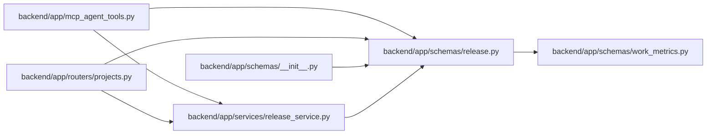

# release Module

**Path:** `backend/app/schemas/release.py`

## Description

Release schemas.

## Imports

| Source | Symbols |
|--------|---------|
| `app.schemas.work_metrics` | `WorkMetricSummary` |
| `datetime` | `date`, `datetime` |
| `enum` | `Enum` |
| `pydantic` | `BaseModel`, `ConfigDict`, `Field` |
| `typing` | `Optional` |

## Local dependency map

<!-- Auto-generated local dependency summary. Do not edit by hand. -->

### Internal neighbors

| Direction | Module |
|---|---|
| Inbound | [mcp_agent_tools](../modules/mcp_agent_tools.md) |
| Inbound | [projects](../modules/projects.md) |
| Inbound | [schemas___init__](../modules/schemas___init__.md) |
| Inbound | [release_service](../modules/release_service.md) |
| Outbound | [schemas_work_metrics](../modules/schemas_work_metrics.md) |

### External packages

| Language | Used packages | Undeclared packages |
|---|---:|---:|
| python | 1 | 0 |

## Classes

| Class | Kind | Line | Bases / Target | Description |
|-------|------|------|----------------|-------------|
| [ReleaseStatus](../entities/schemas_release_ReleaseStatus.md) | Enum | 11 | `str`, `Enum` | Release lifecycle independent of task status. |
| [ReleaseTaskSummary](../entities/schemas_release_ReleaseTaskSummary.md) | Pydantic model | 20 | `BaseModel` | Compact task identity embedded in release responses. |
| [ReleaseCreate](../entities/ReleaseCreate.md) | Pydantic model | 31 | `BaseModel` | Schema for creating a release. |
| [ReleaseCreateRequest](../entities/schemas_release_ReleaseCreateRequest.md) | Pydantic model | 47 | `BaseModel` | API request for creating a project-scoped release. |
| [ReleaseUpdate](../entities/ReleaseUpdate.md) | Pydantic model | 62 | `BaseModel` | Schema for updating a release. |
| [ReleaseUpdateRequest](../entities/schemas_release_ReleaseUpdateRequest.md) | Pydantic model | 77 | `ReleaseUpdate` | API request for partially updating a release. |
| [ReleaseResponse](../entities/ReleaseResponse.md) | Pydantic model | 81 | `WorkMetricSummary` | Schema for release responses. |
