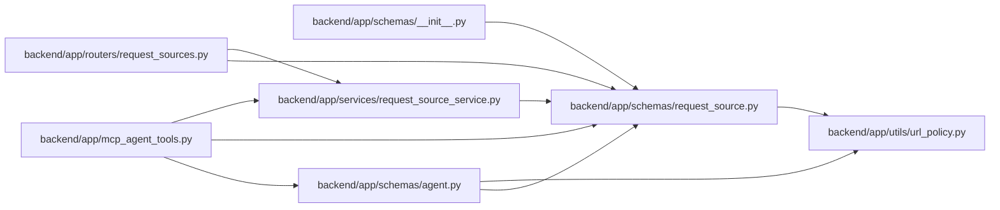

# request_source Module

**Path:** `backend/app/schemas/request_source.py`

## Description

Request source schemas.

## Imports

| Source | Symbols |
|--------|---------|
| `app.utils.url_policy` | `URLPolicyError`, `normalize_stored_display_url` |
| `datetime` | `datetime` |
| `enum` | `Enum` |
| `pydantic` | `BaseModel`, `ConfigDict`, `Field`, `field_validator`, `model_validator` |
| `typing` | `Optional` |

## Local dependency map

<!-- Auto-generated local dependency summary. Do not edit by hand. -->

### Internal neighbors

| Direction | Module |
|---|---|
| Inbound | [mcp_agent_tools](../modules/mcp_agent_tools.md) |
| Inbound | [request_sources](../modules/request_sources.md) |
| Inbound | [schemas___init__](../modules/schemas___init__.md) |
| Inbound | [schemas_agent](../modules/schemas_agent.md) |
| Inbound | [request_source_service](../modules/request_source_service.md) |
| Outbound | [url_policy](../modules/url_policy.md) |

### External packages

| Language | Used packages | Undeclared packages |
|---|---:|---:|
| python | 1 | 0 |

## Classes

| Class | Kind | Line | Bases / Target | Description |
|-------|------|------|----------------|-------------|
| [RequestSourceType](../entities/schemas_request_source_RequestSourceType.md) | Enum | 20 | `str`, `Enum` | Supported lightweight request intake source types. |
| [RequestSourceTargetType](../entities/schemas_request_source_RequestSourceTargetType.md) | Enum | 31 | `str`, `Enum` | Supported request-source link target types. |
| [RequestSourceCreate](../entities/schemas_request_source_RequestSourceCreate.md) | Pydantic model | 39 | `BaseModel` | Schema for creating a request source. |
| [RequestSourceUpdate](../entities/RequestSourceUpdate.md) | Pydantic model | 58 | `BaseModel` | Schema for updating a request source. |
| [RequestSourceResponse](../entities/RequestSourceResponse.md) | Pydantic model | 77 | `BaseModel` | Schema for request source responses. |
| [RequestSourceLinkCreate](../entities/schemas_request_source_RequestSourceLinkCreate.md) | Pydantic model | 93 | `BaseModel` | Schema for linking one request source to one target. |
| [RequestSourceLinkResponse](../entities/RequestSourceLinkResponse.md) | Pydantic model | 115 | `BaseModel` | Schema for request source link responses. |
| [RequestSourceLinkCreateRequest](../entities/RequestSourceLinkCreateRequest.md) | Pydantic model | 128 | `BaseModel` | API request for linking an existing or new request source to a target. |
| [RequestSourceLinkWithSourceResponse](../entities/RequestSourceLinkWithSourceResponse.md) | Pydantic model | 148 | `RequestSourceLinkResponse` | Request-source link response with embedded source details. |

## Functions

| Function | Signature | Decorators | Description |
|----------|-----------|------------|-------------|
| `_normalize_optional_url` | `(value: Optional[str]) -> Optional[str]` | — | — |
