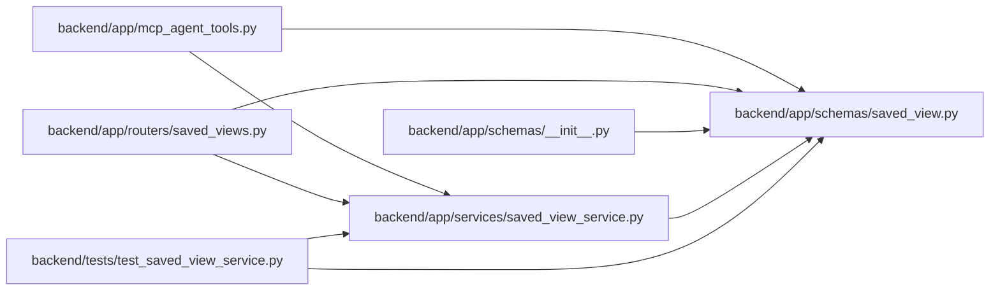

# saved_view Module

**Path:** `backend/app/schemas/saved_view.py`

## Description

Saved view schemas and filter payload validation primitives.

## Imports

| Source | Symbols |
|--------|---------|
| `datetime` | `datetime` |
| `enum` | `Enum` |
| `pydantic` | `BaseModel`, `ConfigDict`, `Field`, `model_validator` |
| `typing` | `Any`, `Optional` |

## Local dependency map

<!-- Auto-generated local dependency summary. Do not edit by hand. -->

### Internal neighbors

| Direction | Module |
|---|---|
| Inbound | [mcp_agent_tools](../modules/mcp_agent_tools.md) |
| Inbound | [saved_views](../modules/saved_views.md) |
| Inbound | [schemas___init__](../modules/schemas___init__.md) |
| Inbound | [saved_view_service](../modules/saved_view_service.md) |
| Inbound | [test_saved_view_service](../modules/test_saved_view_service.md) |

### External packages

| Language | Used packages | Undeclared packages |
|---|---:|---:|
| python | 1 | 0 |

## Classes

| Class | Kind | Line | Bases / Target | Description |
|-------|------|------|----------------|-------------|
| [SavedViewType](../entities/schemas_saved_view_SavedViewType.md) | Enum | 9 | `str`, `Enum` | Surface that a saved view applies to. |
| [SavedViewScope](../entities/schemas_saved_view_SavedViewScope.md) | Enum | 16 | `str`, `Enum` | Visibility scope for a saved view. |
| [SavedViewCreate](../entities/schemas_saved_view_SavedViewCreate.md) | Pydantic model | 23 | `BaseModel` | Schema for creating a saved view. |
| [SavedViewUpdate](../entities/schemas_saved_view_SavedViewUpdate.md) | Pydantic model | 45 | `BaseModel` | Schema for updating a saved view. |
| [SavedViewCreateRequest](../entities/SavedViewCreateRequest.md) | Pydantic model | 67 | `BaseModel` | Public API payload for creating a saved view. |
| [SavedViewUpdateRequest](../entities/SavedViewUpdateRequest.md) | Pydantic model | 81 | `BaseModel` | Public API payload for updating a saved view. |
| [SavedViewDuplicateRequest](../entities/SavedViewDuplicateRequest.md) | Pydantic model | 95 | `BaseModel` | Public API payload for duplicating an existing saved view. |
| [SavedViewResponse](../entities/SavedViewResponse.md) | Pydantic model | 104 | `BaseModel` | Schema for saved view responses. |
| [SavedViewDashboardCardResponse](../entities/SavedViewDashboardCardResponse.md) | Pydantic model | 125 | `BaseModel` | Dashboard card summary backed by a saved view. |
