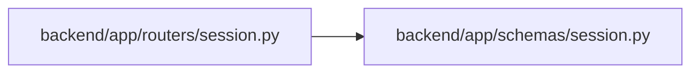

# session Module

**Path:** `backend/app/schemas/session.py`

## Description

_Auto-generated from `backend/app/schemas/session.py`._

## Imports

| Source | Symbols |
|--------|---------|
| `datetime` | `datetime` |
| `pydantic` | `BaseModel`, `ConfigDict` |

## Local dependency map

<!-- Auto-generated local dependency summary. Do not edit by hand. -->

### Internal neighbors

| Direction | Module |
|---|---|
| Inbound | [routers_session](../modules/routers_session.md) |

### External packages

| Language | Used packages | Undeclared packages |
|---|---:|---:|
| python | 1 | 0 |

## Classes

| Class | Line | Bases | Description |
|-------|------|-------|-------------|
| [UserSession](../entities/schemas_session_UserSession.md) | 5 | `BaseModel` | Privacy-safe browser session response. |
