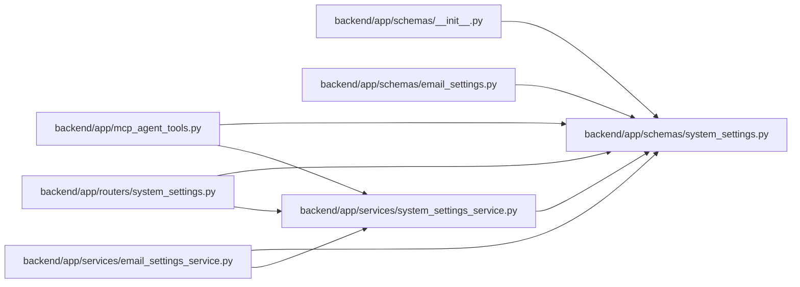

# system_settings Module

**Path:** `backend/app/schemas/system_settings.py`

## Description

Schemas for runtime system settings.

## Imports

| Source | Symbols |
|--------|---------|
| `pydantic` | `BaseModel`, `Field` |
| `typing` | `Literal` |

## Local dependency map

<!-- Auto-generated local dependency summary. Do not edit by hand. -->

### Internal neighbors

| Direction | Module |
|---|---|
| Inbound | [mcp_agent_tools](../modules/mcp_agent_tools.md) |
| Inbound | [routers_system_settings](../modules/routers_system_settings.md) |
| Inbound | [schemas___init__](../modules/schemas___init__.md) |
| Inbound | [schemas_email_settings](../modules/schemas_email_settings.md) |
| Inbound | [email_settings_service](../modules/email_settings_service.md) |
| Inbound | [system_settings_service](../modules/system_settings_service.md) |

### External packages

| Language | Used packages | Undeclared packages |
|---|---:|---:|
| python | 1 | 0 |

## Classes

| Class | Kind | Line | Bases / Target | Description |
|-------|------|------|----------------|-------------|
| [RuntimeSettingSource](../entities/schemas_system_settings_RuntimeSettingSource.md) | Type alias | 7 | `Literal['runtime', 'environment', 'default']` | — |
| [LLMProvider](../entities/schemas_system_settings_LLMProvider.md) | Type alias | 8 | `Literal['openai', 'openrouter', 'nvidia', 'custom']` | — |
| [LanguageCode](../entities/schemas_system_settings_LanguageCode.md) | Type alias | 9 | `Literal['en', 'ru']` | — |
| [AILanguageMode](../entities/schemas_system_settings_AILanguageMode.md) | Type alias | 10 | `Literal['auto', 'en', 'ru']` | — |
| [RuntimeSettingField](../entities/RuntimeSettingField.md) | Pydantic model | 13 | `BaseModel` | One resolved runtime setting field. |
| [RuntimeSecretField](../entities/RuntimeSecretField.md) | Pydantic model | 19 | `RuntimeSettingField` | Resolved secret metadata without exposing the secret. |
| [LLMRuntimeSettingsResponse](../entities/LLMRuntimeSettingsResponse.md) | Pydantic model | 25 | `BaseModel` | Resolved LLM runtime settings. |
| [LLMRuntimeSettingsUpdate](../entities/schemas_system_settings_LLMRuntimeSettingsUpdate.md) | Pydantic model | 37 | `BaseModel` | Update request for LLM runtime settings. |
| [GitHubRuntimeSettingsResponse](../entities/GitHubRuntimeSettingsResponse.md) | Pydantic model | 50 | `BaseModel` | Resolved GitHub runtime settings. |
| [GitHubRuntimeSettingsUpdate](../entities/schemas_system_settings_GitHubRuntimeSettingsUpdate.md) | Pydantic model | 61 | `BaseModel` | Update request for GitHub runtime settings. |
| [WebIntakeRuntimeSettingsResponse](../entities/WebIntakeRuntimeSettingsResponse.md) | Pydantic model | 74 | `BaseModel` | Resolved controlled web-intake runtime settings. |
| [WebIntakeRuntimeSettingsUpdate](../entities/schemas_system_settings_WebIntakeRuntimeSettingsUpdate.md) | Pydantic model | 82 | `BaseModel` | Update request for controlled web-intake runtime settings. |
| [AppRuntimeSettingsResponse](../entities/AppRuntimeSettingsResponse.md) | Pydantic model | 91 | `BaseModel` | Resolved app-wide language behavior. |
| [AppRuntimeSettingsUpdate](../entities/schemas_system_settings_AppRuntimeSettingsUpdate.md) | Pydantic model | 99 | `BaseModel` | Update request for app-wide runtime settings. |
| [RestartRequiredSetting](../entities/schemas_system_settings_RestartRequiredSetting.md) | Pydantic model | 107 | `BaseModel` | Read-only setting that remains environment/startup bound. |
| [SystemSettingsResponse](../entities/SystemSettingsResponse.md) | Pydantic model | 114 | `BaseModel` | Runtime configuration summary. |
