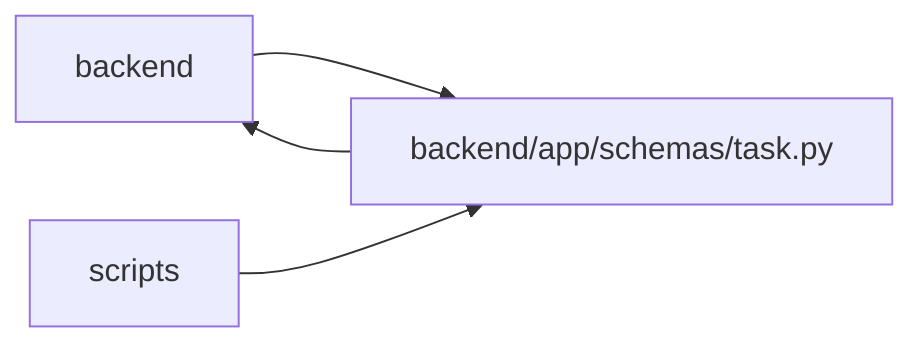

# task Module

**Path:** `backend/app/schemas/task.py`

## Description

Text import requests accept an optional expected iteration revision, and task text context returns the text with the observed revision. Legacy dependency creation accepts an optional expected task version; runtime strict policy determines whether omitted optimistic inputs are rejected.

Task schemas.

## Imports

| Source | Symbols |
|--------|---------|
| `app.schemas.external_link` | `ExternalLinkResponse` |
| `app.schemas.task_brief` | `TaskBrief` |
| `app.schemas.team` | `AssigneeRecommendationResponse` |
| `app.schemas.work_metrics` | `TaskMetricSignals` |
| `app.utils.url_policy` | `URLPolicyError`, `normalize_stored_display_url` |
| `datetime` | `date`, `datetime` |
| `enum` | `Enum` |
| `pydantic` | `BaseModel`, `Field`, `field_validator` |
| `typing` | `Any`, `Literal`, `Optional` |

## Local dependency map

<!-- Auto-generated local dependency summary. Do not edit by hand. -->

> Module-level dependencies exceed the generated-diagram limits, so the diagram and table below group them by top-level package. Counts report the number of module neighbors in each package.

### Internal neighbors

| Direction | Module |
|---|---|
| Inbound | `backend` (29) |
| Inbound | `scripts` (1) |
| Outbound | `backend` (5) |

### External packages

| Language | Used packages | Undeclared packages |
|---|---:|---:|
| python | 1 | 0 |

> All 35 module neighbor(s) are summarized by package because the module-level view exceeds the 12-node limit.

## Classes

| Class | Kind | Line | Bases / Target | Description |
|-------|------|------|----------------|-------------|
| [TaskStatus](../entities/schemas_task_TaskStatus.md) | Enum | 27 | `str`, `Enum` | Task status enumeration for work tracking. |
| [TaskCreate](../entities/schemas_task_TaskCreate.md) | Pydantic model | 38 | `BaseModel` | Schema for creating a task. |
| [TaskUpdate](../entities/schemas_task_TaskUpdate.md) | Pydantic model | 70 | `BaseModel` | Schema for updating a task. |
| [TaskDependencyCreate](../entities/TaskDependencyCreate.md) | Pydantic model | 102 | `BaseModel` | Schema for creating a task dependency. |
| [TaskReorder](../entities/TaskReorder.md) | Pydantic model | 108 | `BaseModel` | Schema for reordering tasks. |
| [TaskMoveRequest](../entities/schemas_task_TaskMoveRequest.md) | Pydantic model | 117 | `BaseModel` | Schema for moving a task subtree to another iteration. |
| [TaskAssignee](../entities/schemas_task_TaskAssignee.md) | Pydantic model | 126 | `BaseModel` | Brief assignee info for task. |
| [TaskClaimedBy](../entities/schemas_task_TaskClaimedBy.md) | Pydantic model | 135 | `BaseModel` | Brief agent info for task claim state. |
| [TaskProject](../entities/schemas_task_TaskProject.md) | Pydantic model | 145 | `BaseModel` | Brief project info for task. |
| [TaskMilestone](../entities/schemas_task_TaskMilestone.md) | Pydantic model | 156 | `BaseModel` | Brief milestone info for task. |
| [TaskAgentReadinessCriterion](../entities/schemas_task_TaskAgentReadinessCriterion.md) | Pydantic model | 168 | `BaseModel` | One deterministic criterion used for agent-readiness evaluation. |
| [TaskAgentReadiness](../entities/schemas_task_TaskAgentReadiness.md) | Pydantic model | 176 | `BaseModel` | Computed advisory readiness for agent execution. |
| [TaskResponse](../entities/TaskResponse.md) | Pydantic model | 187 | `TaskMetricSignals` | Schema for task response. |
| [TaskMerge](../entities/TaskMerge.md) | Pydantic model | 259 | `BaseModel` | Request schema for merging tasks under a new parent. |
| [TaskUnmerge](../entities/TaskUnmerge.md) | Pydantic model | 268 | `BaseModel` | Request schema for unmerging a parent task. |
| [TaskBulkAction](../entities/schemas_task_TaskBulkAction.md) | Type alias | 275 | `Literal['set_assignee', 'clear_assignee', 'auto_assign', 'set_project', 'clear_project', 'set_milestone', 'clear_milestone', 'set_priority', 'add_labels', 'remove_labels', 'set_flags', 'change_status', 'delete']` | — |
| [TaskBulkOutcome](../entities/schemas_task_TaskBulkOutcome.md) | Type alias | 291 | `Literal['updated', 'deleted', 'skipped', 'failed', 'would_update', 'would_delete']` | — |
| [TaskBulkOperationRequest](../entities/schemas_task_TaskBulkOperationRequest.md) | Pydantic model | 294 | `BaseModel` | Request schema for selected-task bulk operations. |
| [TaskBulkOperationResult](../entities/schemas_task_TaskBulkOperationResult.md) | Pydantic model | 304 | `BaseModel` | Per-task result returned by a selected-task bulk operation. |
| [TaskBulkOperationResponse](../entities/schemas_task_TaskBulkOperationResponse.md) | Pydantic model | 315 | `BaseModel` | Response for selected-task bulk operations. |
| [TaskImportDestination](../entities/schemas_task_TaskImportDestination.md) | Type alias | 326 | `Literal['tasks', 'triage', 'auto']` | — |
| [TasksImportRequest](../entities/schemas_task_TasksImportRequest.md) | Pydantic model | 329 | `BaseModel` | Request for importing tasks from text. |
| [TaskTextContext](../entities/schemas_task_TaskTextContext.md) | Pydantic model | 344 | `BaseModel` | One text editing base and its observed iteration revision. |
| [TaskImportTriageItemResponse](../entities/TaskImportTriageItemResponse.md) | Pydantic model | 351 | `BaseModel` | Triage item shape returned by task import endpoints. |
| [TasksImportResponse](../entities/schemas_task_TasksImportResponse.md) | Pydantic model | 376 | `BaseModel` | Response for task import. |
| [TaskStatusChange](../entities/TaskStatusChange.md) | Pydantic model | 385 | `BaseModel` | Request for changing task status. |
| [TaskStatusLogResponse](../entities/TaskStatusLogResponse.md) | Pydantic model | 392 | `BaseModel` | Response for task status log entry. |
| [TaskStatusStats](../entities/schemas_task_TaskStatusStats.md) | Pydantic model | 405 | `BaseModel` | Response for status transition statistics (aggregated). |
| [CascadeUpdateInfo](../entities/schemas_task_CascadeUpdateInfo.md) | Pydantic model | 412 | `BaseModel` | Information about cascading date updates. |
| [TaskStatusChangeResponse](../entities/schemas_task_TaskStatusChangeResponse.md) | Pydantic model | 422 | `BaseModel` | Response for status change with cascade info. |
| [TaskBatchUpdateItem](../entities/schemas_task_TaskBatchUpdateItem.md) | Pydantic model | 429 | `BaseModel` | Schema for a single task update item in a batch. |
| [TaskBatchUpdateRequest](../entities/schemas_task_TaskBatchUpdateRequest.md) | Pydantic model | 437 | `BaseModel` | Schema for updating multiple tasks in a single request. |
| [TaskBatchUpdateResponseItem](../entities/schemas_task_TaskBatchUpdateResponseItem.md) | Pydantic model | 444 | `BaseModel` | Schema for a single task update response inside a batch response. |
| [TaskBatchUpdateResponse](../entities/schemas_task_TaskBatchUpdateResponse.md) | Pydantic model | 451 | `BaseModel` | Response schema for a batch task update. |

## Functions

| Function | Signature | Decorators | Description |
|----------|-----------|------------|-------------|
| `_normalize_optional_url` | `(value: Optional[str]) -> Optional[str]` | — | — |
